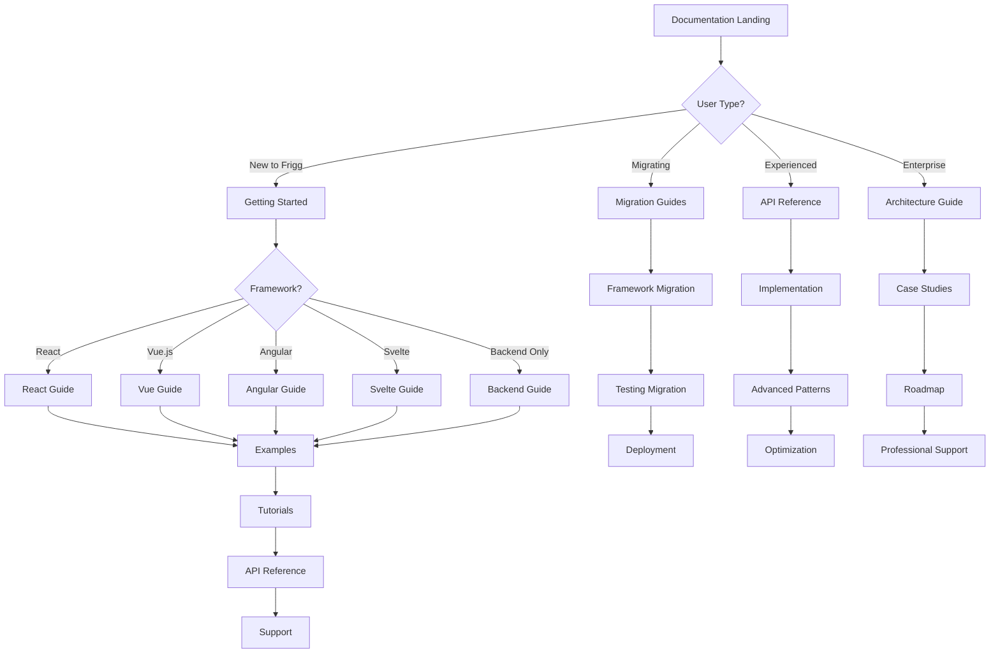

# Frigg Framework Documentation Structure

This document outlines the comprehensive documentation structure for the Frigg Framework multi-framework system, designed to support developers across React, Vue.js, Angular, and Svelte ecosystems.

## Overview

The documentation follows a **user-journey-focused approach** with multiple entry points based on developer needs, experience levels, and framework preferences. It implements the [Diátaxis framework](https://diataxis.fr/) for technical documentation.

## Documentation Website Structure

```
docs/
├── 📚 DOCUMENTATION_STYLE_GUIDE.md          # Style guide and standards
├── 📖 README.md                             # Main landing page
├── 🚀 getting-started/                      # Framework-specific getting started
│   ├── README.md                            # Getting started overview
│   ├── react.md                             # React getting started
│   ├── vue.md                               # Vue.js getting started  
│   ├── angular.md                           # Angular getting started
│   ├── svelte.md                            # Svelte getting started
│   └── backend-only.md                      # Backend-only setup
├── 🔄 migration/                            # Migration guides
│   ├── README.md                            # Migration overview
│   ├── react-to-vue.md                     # React → Vue.js
│   ├── vue-to-react.md                     # Vue.js → React
│   ├── angular-to-react.md                 # Angular → React
│   ├── angular-to-vue.md                   # Angular → Vue.js
│   ├── react-to-angular.md                 # React → Angular
│   ├── vue-to-angular.md                   # Vue.js → Angular
│   ├── svelte-to-react.md                  # Svelte → React
│   ├── react-to-svelte.md                  # React → Svelte
│   ├── from-create-frigg-app.md            # Legacy migration
│   ├── from-custom.md                      # Custom solutions
│   └── from-ipaas.md                       # iPaaS migration
├── 📖 reference/                            # Technical reference
│   ├── api-reference-complete.md           # Complete API reference
│   ├── core-concepts.md                    # Framework concepts
│   ├── architecture.md                     # System architecture
│   ├── configuration.md                    # Configuration reference
│   └── troubleshooting.md                  # Common issues
├── 💡 examples/                             # Examples and tutorials
│   ├── README.md                            # Examples overview
│   ├── react/                               # React examples
│   ├── vue/                                 # Vue.js examples
│   ├── angular/                             # Angular examples
│   ├── svelte/                              # Svelte examples
│   ├── patterns/                            # Common patterns
│   └── case-studies/                        # Real-world case studies
├── 🔧 tutorials/                            # Step-by-step tutorials
│   ├── README.md                            # Tutorials overview
│   ├── your-first-integration.md           # Beginner tutorial
│   ├── authentication-patterns.md          # Auth patterns
│   ├── data-synchronization.md             # Data sync
│   ├── error-handling.md                   # Error handling
│   ├── performance-optimization.md         # Performance
│   ├── testing-strategies.md               # Testing approaches
│   └── deployment-guide.md                 # Production deployment
├── 🤝 contributing/                         # Contribution guides
│   ├── README.md                            # Contributing overview
│   ├── code-of-conduct.md                  # Community guidelines
│   ├── development-setup.md                # Local development
│   ├── pull-request-guidelines.md          # PR standards
│   └── examples-contribution.md            # Example submissions
├── 🆘 support/                              # Support resources
│   ├── README.md                            # Support overview
│   ├── frequently-asked-questions.md       # Common Q&A
│   ├── troubleshooting.md                  # Issue resolution
│   ├── community.md                        # Community resources
│   └── professional-support.md             # Commercial support
└── 🗺️ roadmap/                             # Project roadmap
    ├── README.md                            # Roadmap overview
    ├── current-sprint.md                    # Current development
    ├── upcoming-features.md                 # Planned features
    └── long-term-vision.md                  # Strategic direction
```

## User Journey Mapping

### 🎯 Primary User Personas

#### 1. **Framework Developer** (React/Vue/Angular/Svelte)
- **Goal:** Add Frigg to existing application
- **Entry Point:** Framework-specific getting started guide
- **Journey:** Getting Started → Examples → API Reference → Support

#### 2. **Integration Builder** (Backend Developer)
- **Goal:** Build new integrations from scratch
- **Entry Point:** Backend-only guide or tutorials
- **Journey:** Core Concepts → Your First Integration → Advanced Patterns → Deployment

#### 3. **Framework Migrator** (Switching Frameworks)
- **Goal:** Move from one framework to another
- **Entry Point:** Migration guides
- **Journey:** Migration Overview → Specific Migration Guide → Testing → Deployment

#### 4. **Enterprise Decision Maker** (Architecture/Management)
- **Goal:** Evaluate Frigg for enterprise use
- **Entry Point:** Architecture documentation and case studies
- **Journey:** Architecture → Case Studies → Roadmap → Professional Support

### 🛤️ User Journey Flows



## Content Organization Principles

### 📋 Documentation Types (Diátaxis Framework)

#### 1. **Tutorials** (Learning-Oriented)
- **Purpose:** Guide newcomers through their first successful experience
- **Format:** Step-by-step walkthroughs with working examples
- **Location:** `/tutorials/` and within getting-started guides
- **Examples:**
  - "Your First Integration" tutorial
  - "Building a Complete Dashboard" tutorial
  - Framework-specific implementation tutorials

#### 2. **How-To Guides** (Problem-Oriented)
- **Purpose:** Show how to solve specific problems
- **Format:** Task-focused recipes and patterns
- **Location:** `/examples/patterns/` and framework-specific sections
- **Examples:**
  - "How to implement OAuth 2.0 flow"
  - "How to handle rate limiting"
  - "How to test integrations"

#### 3. **Reference** (Information-Oriented)
- **Purpose:** Provide comprehensive technical specifications
- **Format:** Exhaustive, precise documentation of APIs and configurations
- **Location:** `/reference/`
- **Examples:**
  - Complete API reference
  - Configuration options
  - TypeScript definitions

#### 4. **Explanation** (Understanding-Oriented)
- **Purpose:** Help users understand concepts and design decisions
- **Format:** Conceptual explanations and architectural overviews
- **Location:** `/reference/core-concepts.md` and architecture docs
- **Examples:**
  - "Why Frigg uses serverless architecture"
  - "Understanding the integration lifecycle"
  - "Framework comparison and selection"

### 🔍 Discoverability Features

#### Navigation Structure
```markdown
# Primary Navigation
- 🏠 Home
- 🚀 Getting Started
  - Choose Your Framework
  - Quick Start (5 min)
  - Complete Setup
- 📖 Documentation
  - API Reference
  - Core Concepts
  - Configuration
- 💡 Examples
  - Live Demos
  - Code Samples
  - Case Studies
- 🔄 Migration
  - Framework Migrations
  - Legacy Migrations
- 🤝 Community
  - Contributing
  - Support
  - Roadmap

# Secondary Navigation (Context-Aware)
- Framework-specific sections when applicable
- Related articles and examples
- "What's Next" recommendations
- Cross-references to other frameworks
```

#### Search and Filtering
- **Framework Filter:** Show content relevant to selected framework
- **Difficulty Level:** Beginner, Intermediate, Advanced content filtering
- **Content Type:** Tutorials, Examples, Reference, Migration guides
- **Topic Tags:** Authentication, Deployment, Testing, Performance

#### Cross-References
- **Framework Equivalents:** Link related concepts across frameworks
- **Migration Paths:** Clear connections between migration guides
- **Progressive Complexity:** Link from basic to advanced implementations
- **Related Examples:** Connect reference docs to practical examples

## Framework-Specific Adaptations

### 🔄 React Documentation
- **Focus:** Hook patterns, component composition, performance optimization
- **Special Sections:**
  - Custom hooks for integration logic
  - Error boundaries for robust UX
  - Context patterns for state management
  - React Testing Library examples

### 🟢 Vue.js Documentation  
- **Focus:** Composition API, reactivity, composables
- **Special Sections:**
  - Composable patterns for reusable logic
  - Pinia integration for state management
  - Vue Router patterns
  - Vue Test Utils examples

### 🔴 Angular Documentation
- **Focus:** Services, dependency injection, enterprise patterns
- **Special Sections:**
  - Service-based architecture
  - Reactive forms for configuration
  - NgRx for complex state management
  - Angular testing utilities

### 🟠 Svelte Documentation
- **Focus:** Stores, actions, minimal bundle size
- **Special Sections:**
  - Store patterns for state management
  - Actions for DOM manipulation
  - Transition and animation examples
  - SvelteKit integration

## Quality Assurance

### 📝 Content Standards

#### Technical Accuracy
- **Code Review:** All code examples must be tested and functional
- **Version Compatibility:** Clear version requirements for all dependencies
- **Link Validation:** Regular automated link checking
- **Content Updates:** Quarterly review and update cycle

#### Accessibility
- **Screen Reader Friendly:** Proper heading hierarchy and alt text
- **Keyboard Navigation:** Accessible navigation patterns
- **Color Contrast:** WCAG AA compliance for all visual elements
- **Content Structure:** Clear, scannable content organization

#### Internationalization Readiness
- **Structure:** Designed for future multi-language support
- **Content IDs:** Consistent content identification for translation
- **Cultural Considerations:** Framework preferences by region
- **RTL Support:** Right-to-left language compatibility

### 🔄 Maintenance Workflow

#### Regular Updates
1. **Weekly:** Link validation and broken example detection
2. **Monthly:** Content freshness review and community feedback integration
3. **Quarterly:** Comprehensive review and major updates
4. **Per Release:** Version-specific updates and new feature documentation

#### Community Feedback Integration
- **GitHub Issues:** Documentation improvement requests
- **Discord Feedback:** Real-time community input
- **Usage Analytics:** Data-driven content optimization
- **User Surveys:** Periodic comprehensive feedback collection

## Implementation Plan

### 🚀 Phase 1: Foundation (Completed)
- ✅ Documentation structure design
- ✅ Style guide creation
- ✅ Core framework getting started guides
- ✅ Migration guides framework
- ✅ API reference foundation

### 📈 Phase 2: Content Expansion (Recommended Next Steps)
- 🔄 Complete all framework-specific examples
- 📊 Add comprehensive case studies
- 🧪 Create testing documentation for each framework
- 🚀 Deployment guides for major cloud providers
- 🎯 Performance optimization guides

### 🌐 Phase 3: Interactive Features (Future)
- 🖥️ Interactive documentation website
- 🔍 Advanced search and filtering
- 💬 Community-driven content contributions
- 📱 Mobile-optimized documentation
- 🌍 Multi-language support

## Success Metrics

### 📊 Documentation Effectiveness

#### User Success Metrics
- **Time to First Success:** How quickly new users get a working integration
- **Framework Adoption Rate:** Distribution of framework usage
- **Migration Success Rate:** Percentage of successful framework migrations
- **Support Ticket Volume:** Reduction in documentation-related support requests

#### Content Quality Metrics
- **Content Freshness:** Percentage of up-to-date documentation
- **Link Health:** Percentage of working links and examples
- **User Satisfaction:** Documentation rating and feedback scores
- **Completion Rates:** Tutorial and guide completion statistics

#### Community Engagement
- **Contribution Rate:** Community-submitted examples and improvements
- **Feedback Response Time:** How quickly community feedback is addressed
- **Documentation Usage:** Page views and time spent on different sections
- **Framework Discussion Activity:** Community engagement by framework

---

This documentation structure provides a comprehensive, user-focused approach to supporting developers across all Frigg Framework implementations. It balances depth with accessibility, ensuring that developers can find the information they need regardless of their experience level or framework preference.

**Next Steps:**
1. **Implement interactive website** using this structure
2. **Create content templates** for consistent quality
3. **Establish community contribution** workflows
4. **Set up automated quality assurance** processes