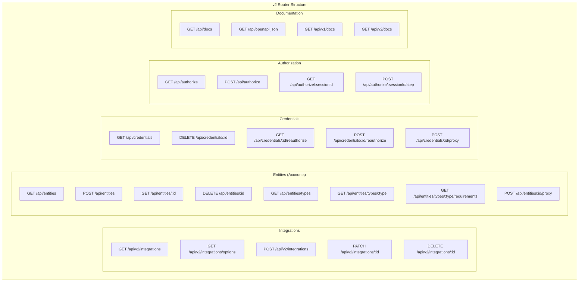
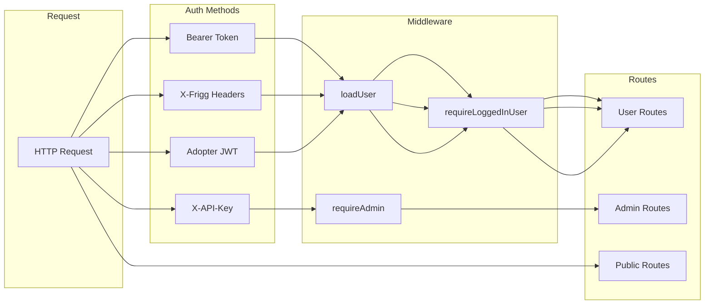
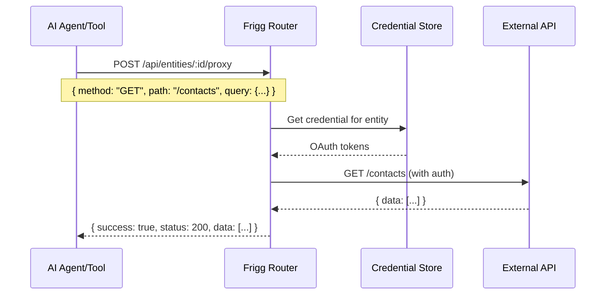
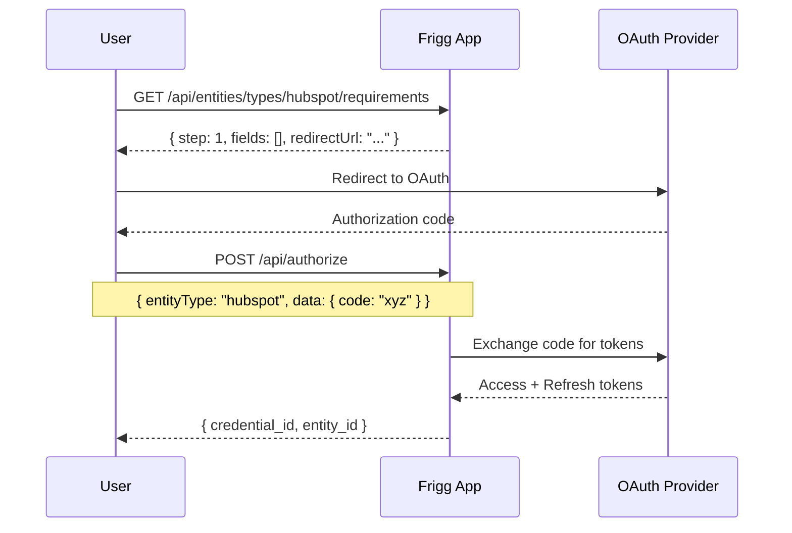

# ADR-006: Integration Router v2 Restructuring

**Status**: Accepted
**Date**: 2025-12-14
**Deciders**: Frigg Core Team

## Context

The Integration Router is the primary API surface for Frigg adopters and their end-users. The v1 API evolved organically with several pain points:

1. **Modules Router Confusion**: `/api/modules/*` endpoints duplicated entity functionality and confused integrators about which to use
2. **Inconsistent Naming**: Mix of singular (`/api/entity`) and plural (`/api/integrations`) endpoints
3. **Missing Capabilities**: No credential management, no proxy endpoints for MCP/tool-calling use cases
4. **No API Documentation**: Required external documentation, no self-describing API

### Current Route Map (v1)

```
/api/integrations          - CRUD operations
/api/modules/*             - DEPRECATED (duplicated entity logic)
/api/entity                - Singular (inconsistent)
/api/authorize             - OAuth flows
```

## Decision

### Route Restructuring

Consolidate and modernize the API surface:



### Key Changes

| Change | Before (v1) | After (v2) | Rationale |
|--------|-------------|------------|-----------|
| Modules Router | `/api/modules/*` | **REMOVED** | Duplicated entity functionality |
| Entity Naming | `/api/entity` (singular) | `/api/entities` (plural) | REST conventions |
| Credentials | None | `/api/credentials/*` | Explicit credential management |
| Proxy Endpoints | None | `/api/entities/:id/proxy` | MCP/tool-calling support |
| Reauthorize | Manual | `/api/credentials/:id/reauthorize` | Self-service credential refresh |
| API Docs | External | `/api/docs` (Scalar UI) | Self-describing API |

### Authentication Architecture



### Proxy Endpoint Flow

New proxy endpoints enable MCP (Model Context Protocol) and tool-calling use cases:



### Authorization Flow (Multi-Step)



### OpenAPI Documentation

Self-describing API with version-specific documentation:

```
GET /api/docs          → Scalar UI with version selector
GET /api/v1/docs       → v1 API documentation
GET /api/v2/docs       → v2 API documentation
GET /api/openapi.json  → Default (v2) OpenAPI spec
```

## Consequences

### Positive

- **Cleaner API surface**: Removes confusion between modules and entities
- **REST conventions**: Plural endpoints, consistent naming
- **Self-documenting**: OpenAPI specs with interactive Scalar UI
- **MCP-ready**: Proxy endpoints enable AI agent integration
- **Credential lifecycle**: Explicit management and re-authorization
- **Backward compatible**: v1 routes preserved during migration

### Negative

- **Migration effort**: Existing integrations need to update endpoints
- **Documentation updates**: All guides need endpoint updates
- **Testing burden**: Both v1 and v2 need test coverage

### Neutral

- v1 endpoints remain functional (no breaking changes)
- New features only available on v2 endpoints

## Implementation Phases

| Phase | Scope | Status |
|-------|-------|--------|
| 1 | Remove modules router, consolidate entities | ✅ |
| 2 | Add credentials router with proxy | ✅ |
| 3 | OpenAPI specs and Scalar UI | ✅ |
| 4 | Management UI updates | ✅ |
| 5 | @friggframework/ui updates | Pending |

## Related

- [Integration Router Implementation](/packages/core/integrations/integration-router.js)
- [API Router v2 Spec](/docs/specs/api-router-v2-restructuring.md)
- [OpenAPI Specs](/packages/core/handlers/routers/openapi/)
