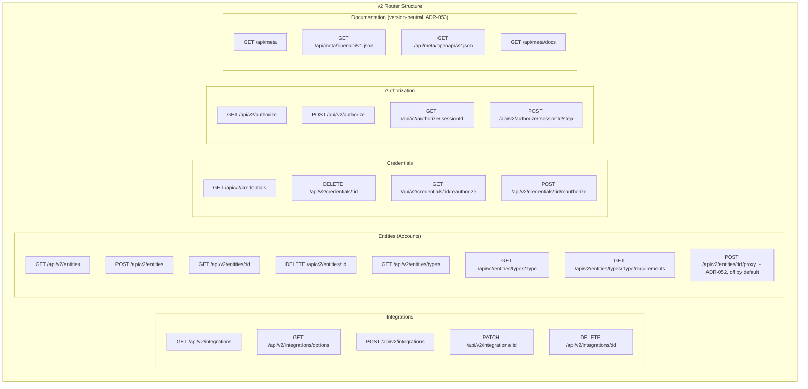
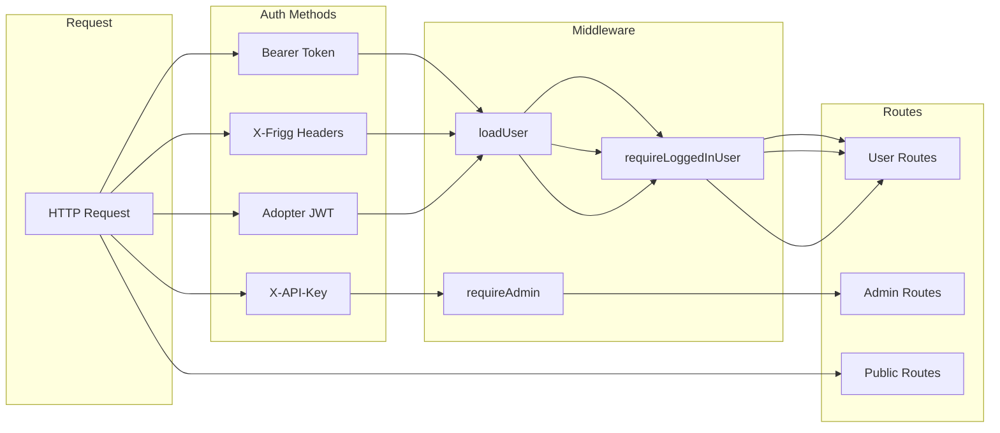
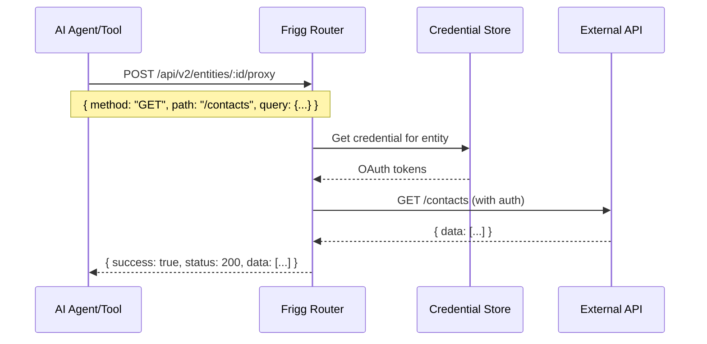
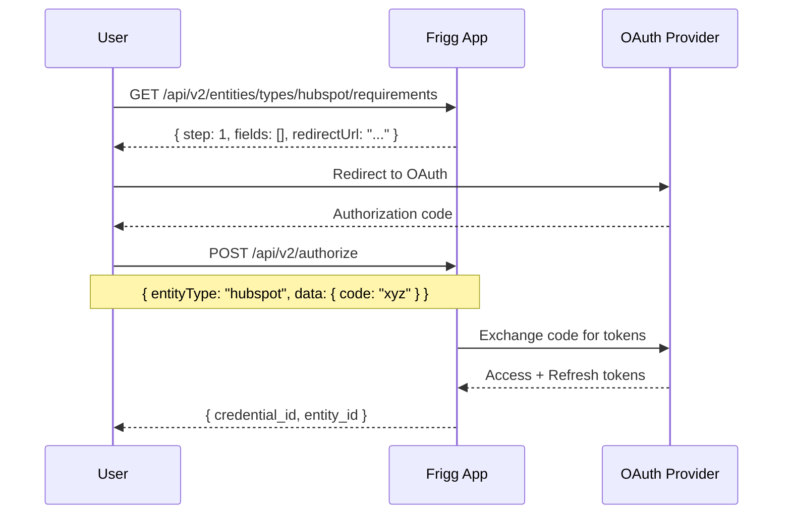

# ADR-006: Integration Router v2 Restructuring

**Status**: Accepted
**Date**: 2025-12-14
**Deciders**: Frigg Core Team

> **Amended by [ADR-053](./053-management-api-versioning.md) (Management API
> Versioning) and [ADR-052](./052-entity-proxy-security.md) (Entity Proxy
> Security), 2026-10-03.** The content decisions below stand: drop the modules
> router, plural entities, credentials, the proxy, OpenAPI. The path decisions
> are amended: every v2 resource lives under `/api/v2/`, unprefixed `/api/*` is
> frozen as v1, and the API is described under `/api/meta`. ADR-052 sets the
> security rules for the entity proxy and defers the credential-level proxy.
> The v2 build is on `feature/integration-router-v2-drop-modules-router`
> (PR #522), not on `next`; see Implementation Phases.

## Context

The Integration Router is the primary API surface for Frigg adopters and their end-users. The v1 API evolved organically with several pain points:

1. **Modules Router Confusion**: `/api/modules/*` endpoints duplicated entity functionality and confused integrators about which to use
2. **Inconsistent Naming**: Mix of singular (`/api/entity`) and plural (`/api/integrations`) endpoints
3. **Missing Capabilities**: No credential management, no proxy endpoints for MCP/tool-calling use cases
4. **No API Documentation**: Required external documentation, no self-describing API

### Current Route Map (v1)

```
/api/integrations          - CRUD operations
/api/modules/*             - REMOVED (duplicated entity logic; already gone on `next`)
/api/entity                - Singular (inconsistent)
/api/entities/:entityId/*  - Entity test-auth and options
/api/authorize             - OAuth flows
```

These unprefixed routes are v1. Per ADR-053 they are frozen: no new unprefixed
routes are added, and v2 never reuses these paths.

## Decision

### Route Restructuring

Consolidate and modernize the API surface:


```mermaid
graph TB
    subgraph "v2 Router Structure"
        subgraph "Integrations"
            I1[GET /api/v2/integrations]
            I2[GET /api/v2/integrations/options]
            I3[POST /api/v2/integrations]
            I4[PATCH /api/v2/integrations/:id]
            I5[DELETE /api/v2/integrations/:id]
        end

        subgraph "Entities (Accounts)"
            E1[GET /api/v2/entities]
            E2[POST /api/v2/entities]
            E3[GET /api/v2/entities/:id]
            E4[DELETE /api/v2/entities/:id]
            E5[GET /api/v2/entities/types]
            E6[GET /api/v2/entities/types/:type]
            E7[GET /api/v2/entities/types/:type/requirements]
            E8[POST /api/v2/entities/:id/proxy  - ADR-052, off by default]
        end

        subgraph "Credentials"
            C1[GET /api/v2/credentials]
            C2[DELETE /api/v2/credentials/:id]
            C3[GET /api/v2/credentials/:id/reauthorize]
            C4[POST /api/v2/credentials/:id/reauthorize]
        end

        subgraph "Authorization"
            A1[GET /api/v2/authorize]
            A2[POST /api/v2/authorize]
            A3[GET /api/v2/authorize/:sessionId]
            A4[POST /api/v2/authorize/:sessionId/step]
        end

        subgraph "Documentation (version-neutral, ADR-053)"
            D1[GET /api/meta]
            D2[GET /api/meta/openapi/v1.json]
            D3[GET /api/meta/openapi/v2.json]
            D4[GET /api/meta/docs]
        end
    end
```

### Key Changes

| Change | Before (v1) | After (v2) | Rationale |
|--------|-------------|------------|-----------|
| Modules Router | `/api/modules/*` | **REMOVED** | Duplicated entity functionality |
| Entity Naming | `/api/entity` (singular) | `/api/v2/entities` (plural) | REST conventions |
| Credentials | None | `/api/v2/credentials/*` | Explicit credential management |
| Proxy Endpoints | None | `/api/v2/entities/:id/proxy` | MCP/tool-calling support. Secured per ADR-052; the credential-level proxy (`/api/credentials/:id/proxy`) is deferred by ADR-052 |
| Reauthorize | Manual | `/api/v2/credentials/:id/reauthorize` | Self-service credential refresh |
| API Docs | External | `/api/meta/docs` (Scalar UI) and `/api/meta/openapi/v{n}.json` | Self-describing API (ADR-053 §5) |

### Authentication Architecture


```mermaid
flowchart LR
    subgraph "Request"
        R[HTTP Request]
    end

    subgraph "Auth Methods"
        B[Bearer Token]
        X[X-API-Key]
        H[X-Frigg Headers]
        J[Adopter JWT]
    end

    subgraph "Middleware"
        LU[loadUser]
        RLI[requireLoggedInUser]
        RA[requireAdmin]
    end

    subgraph "Routes"
        USER[User Routes]
        ADMIN[Admin Routes]
        PUBLIC[Public Routes]
    end

    R --> B --> LU --> RLI --> USER
    R --> X --> RA --> ADMIN
    R --> H --> LU --> RLI --> USER
    R --> J --> LU --> RLI --> USER
    R --> PUBLIC
```

### Proxy Endpoint Flow

New proxy endpoints enable MCP (Model Context Protocol) and tool-calling use cases.
[ADR-052](./052-entity-proxy-security.md) sets the security rules (feature flag,
ownership, module allow-list, path-only input, header stripping, limits, audit):


```mermaid
sequenceDiagram
    participant Client as AI Agent/Tool
    participant Frigg as Frigg Router
    participant Cred as Credential Store
    participant API as External API

    Client->>Frigg: POST /api/v2/entities/:id/proxy
    Note over Client,Frigg: { method: "GET", path: "/contacts", query: {...} }

    Frigg->>Cred: Get credential for entity
    Cred-->>Frigg: OAuth tokens

    Frigg->>API: GET /contacts (with auth)
    API-->>Frigg: { data: [...] }

    Frigg-->>Client: { success: true, status: 200, data: [...] }
```

### Authorization Flow (Multi-Step)


```mermaid
sequenceDiagram
    participant User
    participant App as Frigg App
    participant OAuth as OAuth Provider

    User->>App: GET /api/v2/entities/types/hubspot/requirements
    App-->>User: { step: 1, fields: [], redirectUrl: "..." }

    User->>OAuth: Redirect to OAuth
    OAuth-->>User: Authorization code

    User->>App: POST /api/v2/authorize
    Note over User,App: { entityType: "hubspot", data: { code: "xyz" } }

    App->>OAuth: Exchange code for tokens
    OAuth-->>App: Access + Refresh tokens

    App-->>User: { credential_id, entity_id }
```

### OpenAPI Documentation

Self-describing API with version-specific documentation, in the
version-neutral `/api/meta` namespace (ADR-053 §4-5):

```
GET /api/meta                    → supported API majors, status, capabilities
GET /api/meta/docs               → Scalar UI with version selector (off by default in production stages)
GET /api/meta/openapi/v1.json    → frozen v1 spec (for migration)
GET /api/meta/openapi/v2.json    → v2 spec
```

The `packages/schemas/schemas/api-*.schema.json` descriptions that name
`/api/entities...` and `/api/credentials...` change to `/api/v2/entities...` and
`/api/v2/credentials...` with the v2 build.

## Consequences

### Positive

- **Cleaner API surface**: Removes confusion between modules and entities
- **REST conventions**: Plural endpoints, consistent naming
- **Self-documenting**: OpenAPI specs with interactive Scalar UI
- **MCP-ready**: Proxy endpoints enable AI agent integration
- **Credential lifecycle**: Explicit management and re-authorization
- **Backward compatible**: v1 is frozen and deprecated per ADR-053 §6, and removed no earlier than core 3.0

### Negative

- **Migration effort**: Existing integrations need to update endpoints
- **Documentation updates**: All guides need endpoint updates
- **Testing burden**: Both v1 and v2 need test coverage

### Neutral

- v1 endpoints remain functional through all of core 2.x (no breaking changes); see ADR-053 §6 for deprecation signals and removal
- New features only available on v2 endpoints

## Implementation Phases

Phases 1-4 were previously marked done. They are not on `next`: apart from the
removal of `/api/modules/*`, they are on
`feature/integration-router-v2-drop-modules-router` (PR #522), and they are
rebuilt under `/api/v2` per ADR-053 before they merge.

| Phase | Scope | Status |
|-------|-------|--------|
| 1 | Remove modules router, consolidate entities | Modules router removed on `next`; entity consolidation on the feature branch |
| 2 | Add credentials router with proxy | On the feature branch; proxy reworked per ADR-052 |
| 3 | OpenAPI specs and Scalar UI | On the feature branch; moves under `/api/meta` (ADR-053) |
| 4 | Management UI updates | On the feature branch |
| 5 | @friggframework/ui updates | Pending |
| 6 | Route registry + `/api/meta` + deprecation headers (ADR-053) | Pending |
| 7 | Entity proxy hardening (ADR-052) | Pending |

## Related

- [ADR-053: Management API Versioning](./053-management-api-versioning.md) — amends the paths in this ADR
- [ADR-052: Entity Proxy Security](./052-entity-proxy-security.md) — security rules for the proxy endpoint
- [Integration Router Implementation](/packages/core/integrations/integration-router.js)
- [API Router v2 Spec](/docs/specs/api-router-v2-restructuring.md)
- OpenAPI specs: `packages/core/handlers/routers/openapi/` on `feature/integration-router-v2-drop-modules-router` (not on `next`)
