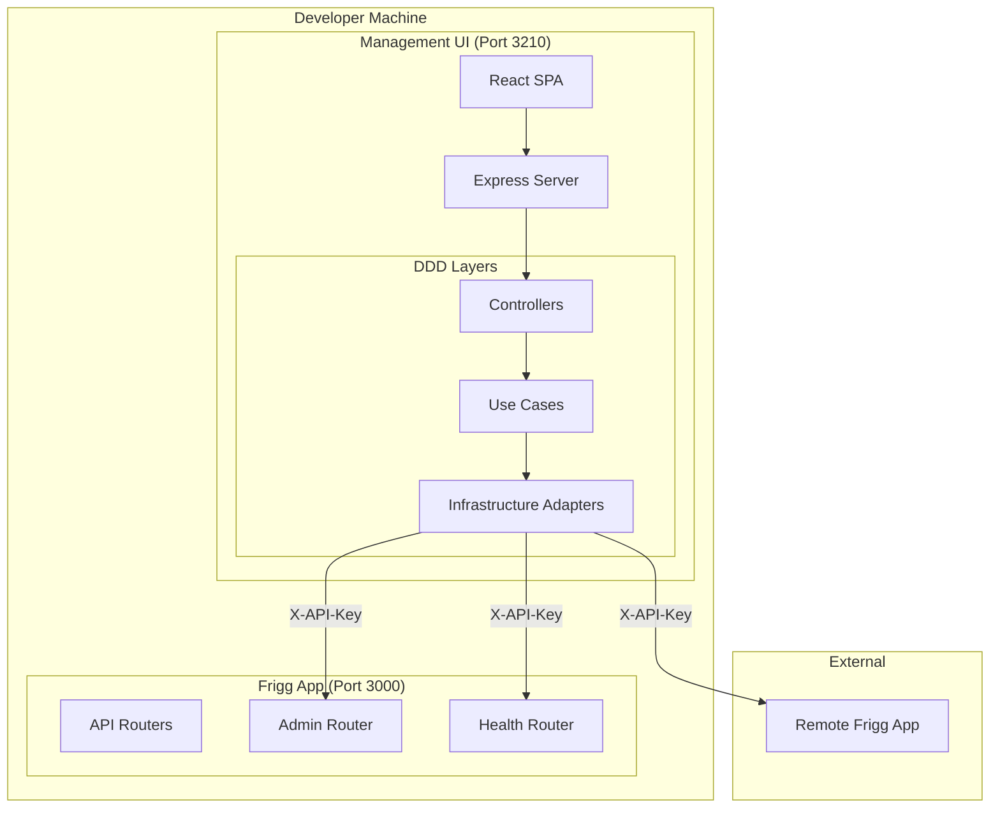
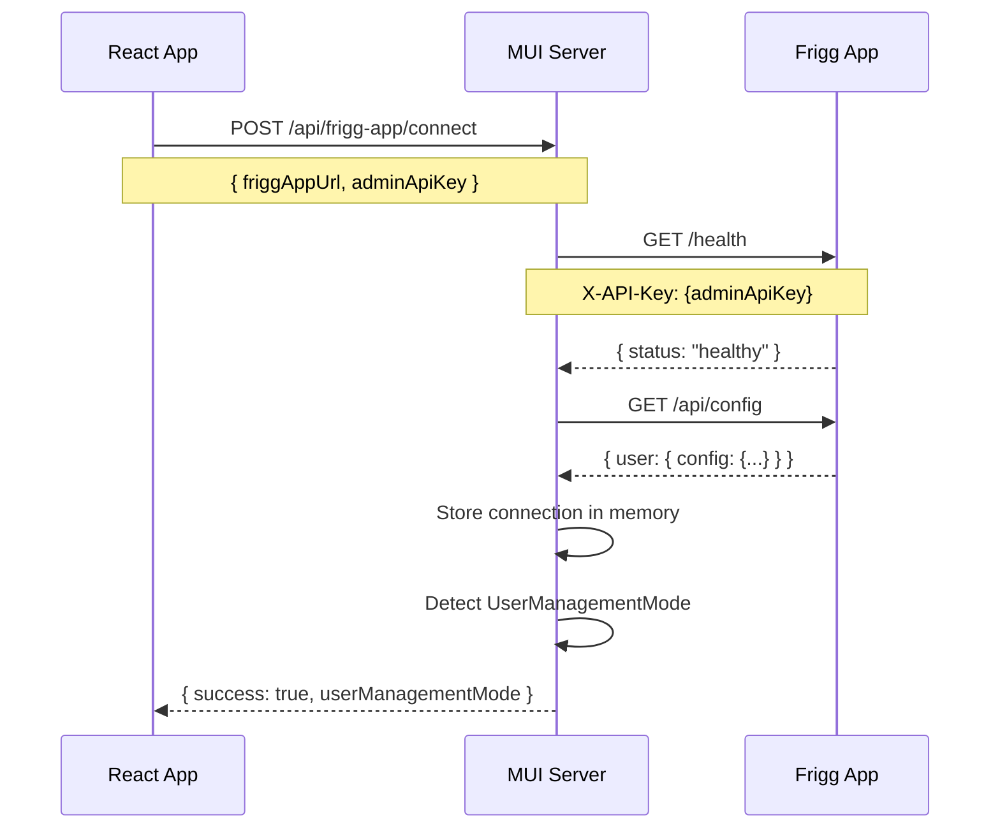
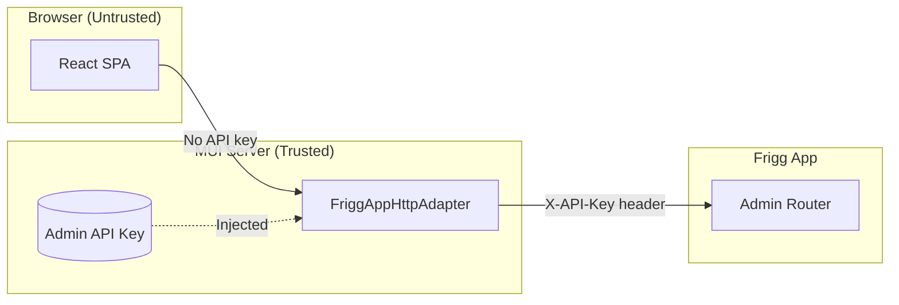
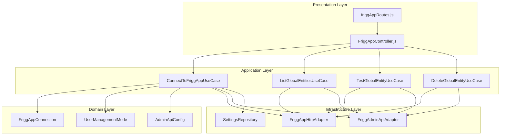
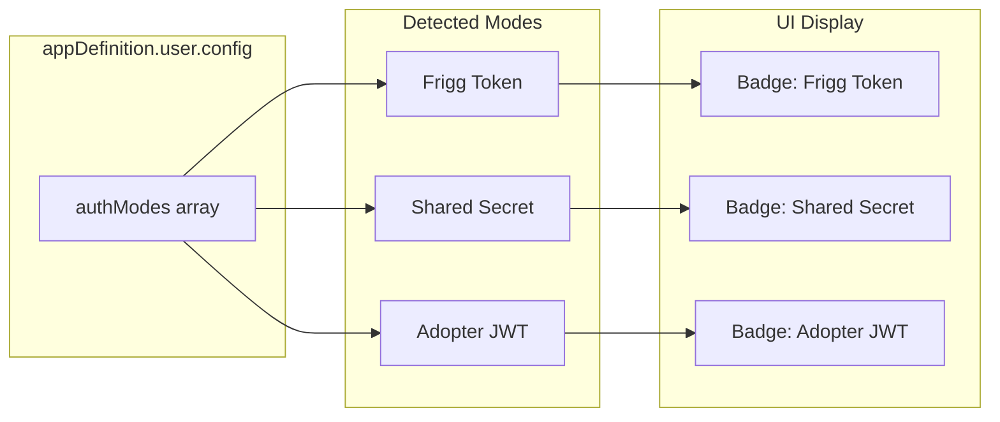
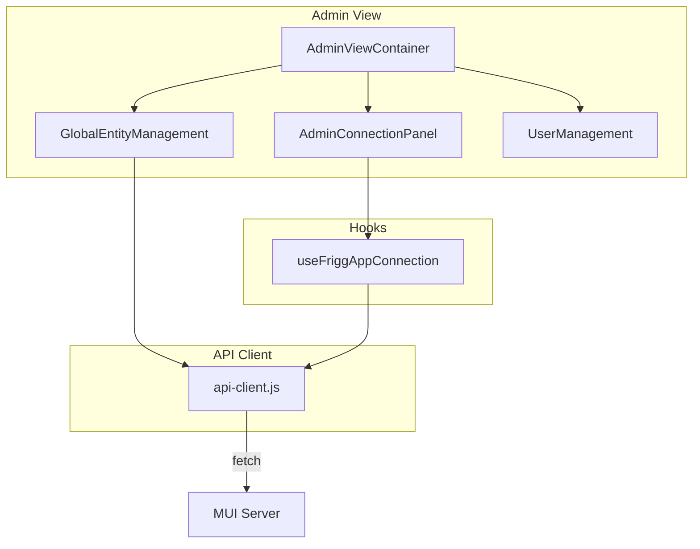

# ADR-007: Management UI Architecture

**Status**: Accepted
**Date**: 2025-12-14
**Deciders**: Frigg Core Team

## Context

Frigg adopters need a development interface to:
1. Manage local Frigg projects during development
2. Connect to running Frigg apps for admin operations
3. Test integrations and manage users/entities

The Management UI must work across different environments:
- Local development (via `frigg ui`)
- Connected to remote Frigg apps (staging/production)
- Standalone for project scaffolding

### Challenges

1. **Security**: Admin API keys shouldn't be exposed to browser
2. **Multi-environment**: Same UI for local and remote apps
3. **State management**: No database for local dev tools (per ADR-002)
4. **DDD compliance**: Follow hexagonal architecture patterns

## Decision

### System Architecture

The Management UI operates as a **separate Express server** that proxies requests to running Frigg apps:



### Connection Flow



### Proxy Pattern

The Management UI server acts as a secure proxy:



**Why proxy?**
- Admin API key never sent to browser
- Server validates requests before forwarding
- Consistent error handling and logging
- Single point for rate limiting/auditing

### DDD Layer Architecture



### Value Objects

**FriggAppConnection**: Immutable connection state

```javascript
FriggAppConnection.disconnected()
FriggAppConnection.connecting(config)
FriggAppConnection.connected({ config, healthStatus, userManagementMode })
FriggAppConnection.error(config, errorMessage)
```

**UserManagementMode**: Auth configuration from appDefinition

```javascript
UserManagementMode.fromAppDefinition(appDef)
// Detects: friggTokenEnabled, sharedSecretEnabled, adopterJwtEnabled, usePassword
```

**AdminApiConfig**: Connection configuration

```javascript
new AdminApiConfig({ baseUrl, apiKey, timeout })
config.validate()
config.getAuthHeaders()  // { 'X-API-Key': apiKey }
config.getNormalizedBaseUrl()
```

### User Management Modes

Frigg supports multiple authentication strategies. The Management UI detects and displays the active mode:



| Mode | Header | Use Case |
|------|--------|----------|
| Frigg Token | `Authorization: Bearer {token}` | Direct user auth |
| Shared Secret | `X-Frigg-AppUserId` | B2B embedded integrations |
| Adopter JWT | Custom JWT validation | White-label deployments |

### API Routes

```
Management UI Server (:3210)
├── /api/projects/*              # Local project management
├── /api/git/*                   # Git operations
├── /api/frigg-app/
│   ├── POST   /connect          # Connect to Frigg app
│   ├── POST   /disconnect       # Disconnect
│   ├── GET    /connection-status
│   ├── GET    /user-management-mode
│   ├── GET    /auth-methods
│   └── /admin/
│       ├── GET    /users
│       ├── POST   /users
│       ├── DELETE /users/:id
│       ├── POST   /users/:id/impersonate
│       ├── GET    /global-entities
│       ├── POST   /global-entities
│       ├── PUT    /global-entities/:id
│       ├── DELETE /global-entities/:id
│       └── POST   /global-entities/:id/test
└── /api/health                  # MUI health check
```

### React Component Architecture



## Consequences

### Positive

- **Secure**: Admin API key never exposed to browser
- **Flexible**: Works with local and remote Frigg apps
- **DDD compliant**: Clean separation of concerns
- **Testable**: Each layer can be unit tested with mocks
- **Observable**: Connection state visible in UI

### Negative

- **Extra hop**: All admin requests go through MUI server
- **Memory state**: Connection lost on server restart
- **Port conflict**: Needs different port than Frigg app

### Risks Mitigated

- **Credential leakage**: API key stays server-side
- **CORS issues**: Server-to-server has no CORS
- **Mixed environments**: Clear separation of local vs remote

## Related

- [ADR-002: No Database for Local Development Tools](./002-no-database-for-local-dev.md)
- [ADR-003: Runtime State Only for Management GUI](./003-runtime-state-only.md)
- [Management UI Server](/packages/devtools/management-ui/server/)
- [FriggAppHttpAdapter](/packages/devtools/management-ui/server/src/infrastructure/adapters/FriggAppHttpAdapter.js)
