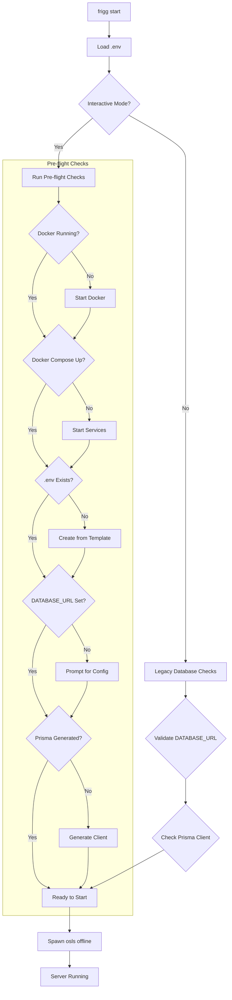
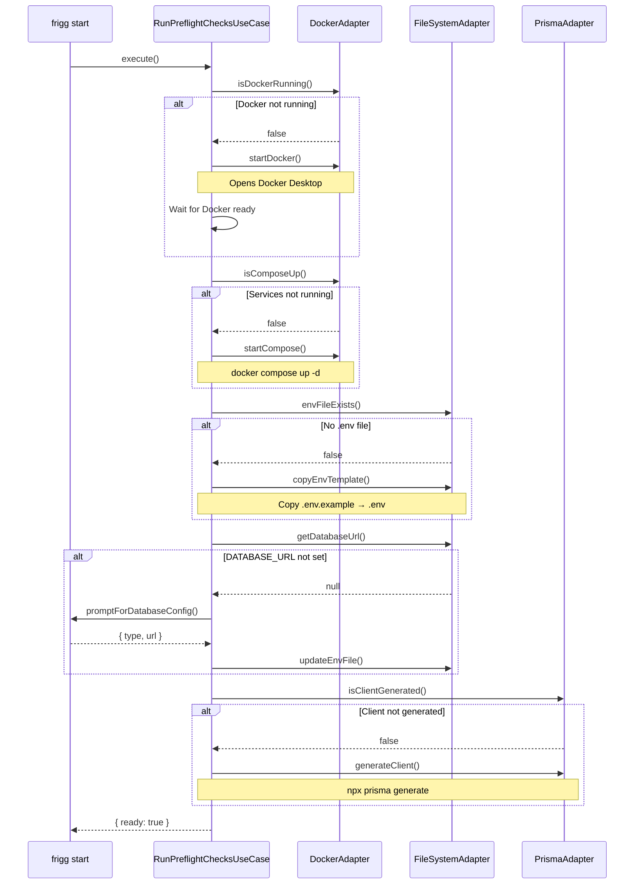
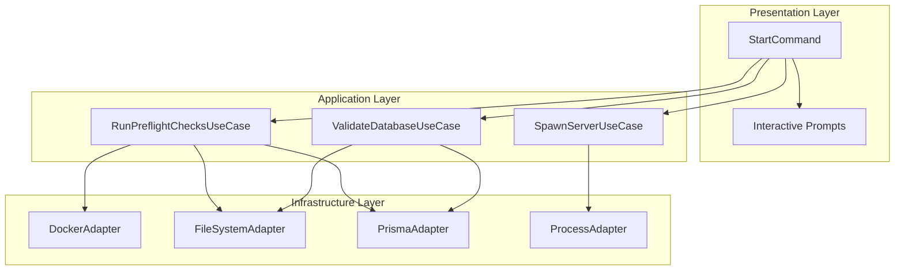
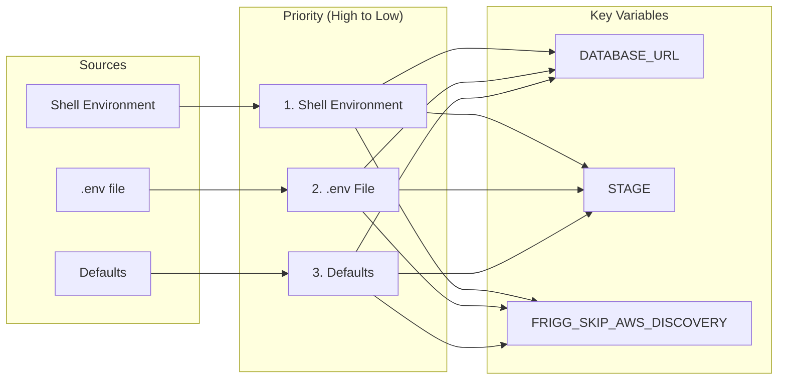
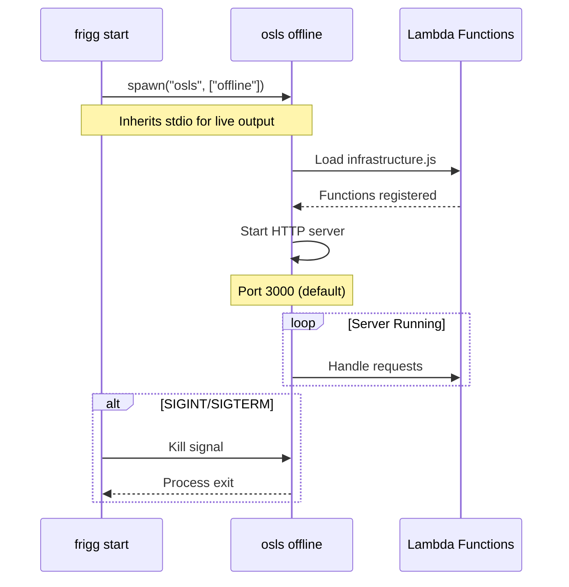
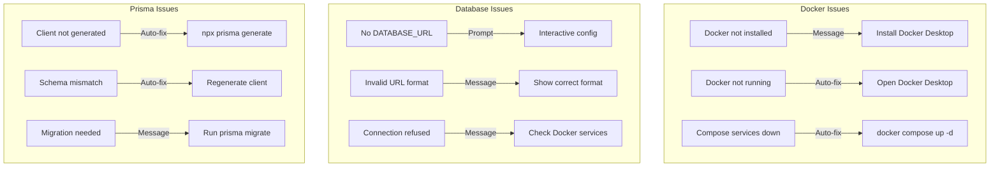

# ADR-008: Frigg CLI Start Command Architecture

**Status**: Accepted
**Date**: 2025-12-14
**Deciders**: Frigg Core Team

## Context

Local development of Frigg applications requires:
1. Database connectivity (MongoDB or PostgreSQL)
2. Prisma client generation
3. Environment variable configuration
4. Serverless offline execution

Developers frequently encounter issues:
- Docker not running
- Database not started
- Missing `.env` file
- Prisma client not generated
- Port conflicts

### Goals

1. **Zero-friction startup**: `frigg start` should "just work"
2. **Clear error messages**: Guide developers to fix issues
3. **Interactive recovery**: Offer to fix problems automatically
4. **Consistent environment**: Same behavior across dev machines

## Decision

### Command Flow



### Pre-flight Check System



### DDD Layer Architecture



### Environment Variable Handling



### Stage Configuration

| Stage | AWS Discovery | Encryption | Database |
|-------|---------------|------------|----------|
| `local` | Skipped | Bypassed | Docker Compose |
| `dev` | Skipped | Bypassed | Remote or Docker |
| `production` | Enabled | KMS/AES | Remote |

```javascript
// Environment set by start command
AWS_SDK_JS_SUPPRESS_MAINTENANCE_MODE_MESSAGE=1
FRIGG_SKIP_AWS_DISCOVERY=true  // Always for local dev
STAGE=local|dev|production
```

### Server Process Management



### Error Recovery Strategies



### Command Options

```bash
frigg start [options]

Options:
  --stage <stage>    Environment stage (local|dev|production)
  --port <port>      Server port (default: 3000)
  --no-preflight     Skip pre-flight checks
  --docker           Require Docker (fail if not available)
  --verbose          Verbose output
```

## Consequences

### Positive

- **Developer experience**: Most issues auto-resolved
- **Consistent environment**: Same setup across machines
- **Clear guidance**: Error messages explain solutions
- **Flexible**: Works with or without Docker
- **Fast iteration**: Hot reload via serverless-offline

### Negative

- **Docker dependency**: Best experience requires Docker
- **Startup time**: Pre-flight checks add ~2-5 seconds
- **Complexity**: Multiple code paths for different scenarios

### Risks Mitigated

- **Port conflicts**: Checks before starting
- **Missing dependencies**: Validates Prisma client
- **Configuration errors**: Interactive prompts for missing config

## Implementation

### File Structure

```
packages/devtools/frigg-cli/start-command/
├── index.js                    # Command entry point
├── application/
│   ├── RunPreflightChecksUseCase.js
│   ├── ValidateDatabaseUseCase.js
│   └── SpawnServerUseCase.js
├── infrastructure/
│   ├── DockerAdapter.js
│   ├── FileSystemAdapter.js
│   ├── PrismaAdapter.js
│   └── ProcessAdapter.js
└── presentation/
    └── InteractivePrompts.js
```

### Exit Codes

| Code | Meaning |
|------|---------|
| 0 | Success |
| 1 | Pre-flight check failed (non-recoverable) |
| 2 | User cancelled |
| 3 | Server crashed |
| 130 | SIGINT (Ctrl+C) |

## Related

- [ADR-002: No Database for Local Development Tools](./002-no-database-for-local-dev.md)
- [Frigg CLI](/packages/devtools/frigg-cli/)
- [Start Command Implementation](/packages/devtools/frigg-cli/start-command/index.js)
- [Docker Compose Config](/docker-compose.yml)
