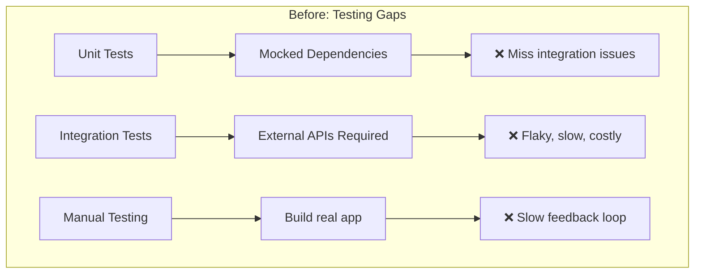
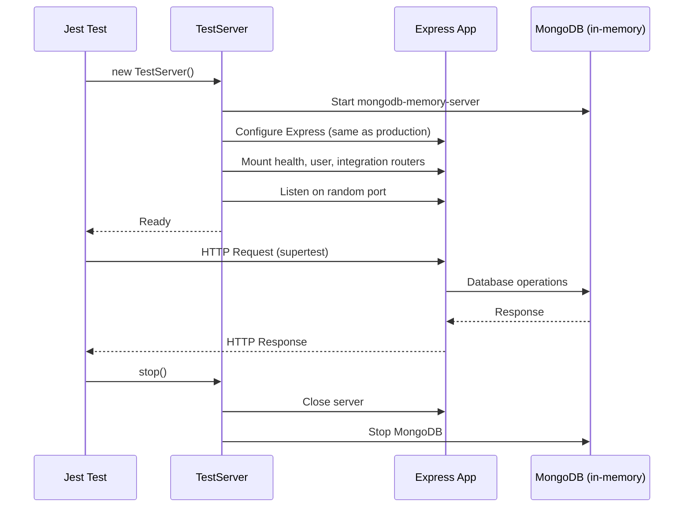
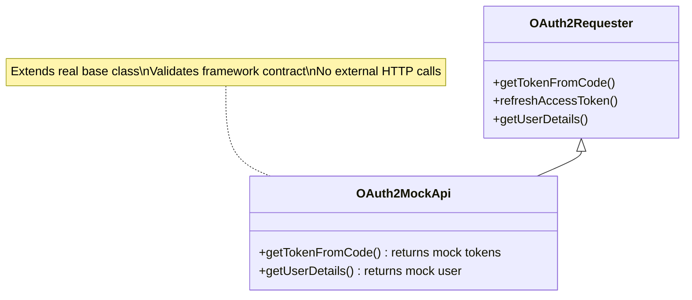
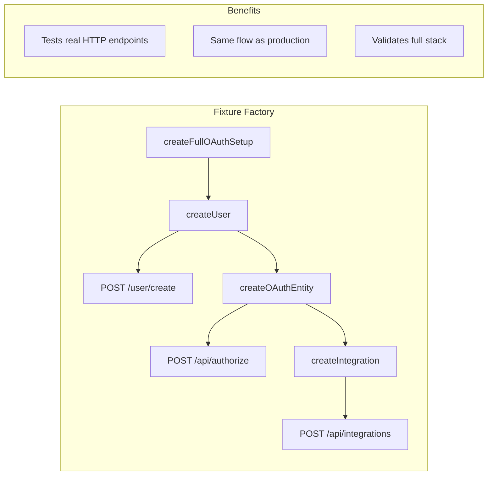

# ADR-009: E2E Test Package Architecture

**Status**: Accepted
**Date**: 2025-12-15
**Deciders**: Frigg Core Team

## Context

Before the e2e test package, testing the Frigg Framework had significant gaps:

1. **Unit tests were isolated** - They tested individual components with mocked dependencies, missing integration issues between layers
2. **Real integration tests required external services** - Testing OAuth flows, webhooks, and API modules required live third-party APIs
3. **No confidence in full lifecycle** - The complete journey (user creation → entity authentication → integration creation → webhook processing) was never tested as a cohesive flow
4. **Regression detection was slow** - Breaking changes in core APIs weren't caught until someone tried to build an actual app

### Testing Challenges



## Decision

Create `@friggframework/e2e` - a self-contained end-to-end test package that:

1. Uses `mongodb-memory-server` for a real MongoDB instance without external dependencies
2. Provides mock API modules that simulate OAuth2, form-based, and webhook authentication
3. Spins up a real Express server configured identically to production Frigg apps
4. Tests complete integration lifecycles through HTTP requests

### Package Structure

```
packages/e2e/
├── __tests__/
│   ├── helpers/              # Test utilities
│   │   ├── setup.js          # MongoDB + env setup
│   │   ├── test-server.js    # Express server wrapper
│   │   ├── fixtures.js       # Test data factories
│   │   └── db-cleanup.js     # Database cleanup
│   ├── lifecycle/            # Integration lifecycle tests
│   │   ├── oauth-flow.test.js
│   │   ├── form-auth-flow.test.js
│   │   └── webhook-flow.test.js
│   ├── management-api/       # Admin endpoint tests
│   │   ├── health.test.js
│   │   ├── integrations.test.js
│   │   └── entities.test.js
│   └── edge-cases/           # Error handling tests
│       ├── error-scenarios.test.js
│       └── user-scenarios.test.js
├── test-app/                 # Minimal Frigg app
│   └── backend/
│       ├── index.js          # App definition
│       ├── api-modules/      # Mock modules
│       │   ├── oauth2MockModule.js
│       │   ├── formBasedMockModule.js
│       │   └── webhookMockModule.js
│       └── integrations/     # Integration classes
│           ├── oauthIntegration.js
│           ├── formBasedIntegration.js
│           └── webhookIntegration.js
├── jest.config.js
└── package.json
```

### Test Server Architecture



### Mock API Module Pattern

Mock modules extend real base classes but override HTTP methods:



### Test Fixture Flow



### Test Categories

| Category | Purpose | Examples |
|----------|---------|----------|
| **Lifecycle** | Complete integration journeys | OAuth flow, form auth, webhook processing |
| **Management API** | Health and admin endpoints | `/health/*`, integrations CRUD |
| **Edge Cases** | Error handling | Auth failures, 404s, malformed requests, concurrency |

## Consequences

### Positive

- **Self-contained**: No external services required (MongoDB in-memory)
- **Realistic**: Uses same Express middleware as production
- **Complete coverage**: Tests full user journey, not isolated components
- **Fast feedback**: Catches breaking changes before release
- **Framework contract validation**: Mock modules prove the extension points work

### Negative

- **MongoDB only**: Currently doesn't test PostgreSQL/Prisma path
- **No encryption testing**: Runs with `STAGE=test` which bypasses encryption
- **Single-module focus**: Doesn't test multi-module integrations
- **No async job testing**: SQS workers not covered

### Neutral

- Tests run with 30-second timeout (adequate for most scenarios)
- Database wiped between each test (isolation over speed)
- Port 0 used for parallel test safety

## Future Improvements

### High Priority

| Improvement | Description | Effort |
|-------------|-------------|--------|
| PostgreSQL support | Parallel test suite for Prisma | Medium |
| Encryption testing | Test with encryption enabled | Low |
| Multi-module integrations | Test module coordination | Medium |

### Medium Priority

| Improvement | Description | Effort |
|-------------|-------------|--------|
| WebSocket testing | Real-time connection tests | Medium |
| Job queue testing | SQS worker coverage (LocalStack) | High |
| Token refresh flows | OAuth refresh-on-401 | Low |

### Nice to Have

| Improvement | Description | Effort |
|-------------|-------------|--------|
| Performance benchmarks | Baseline regression detection | Medium |
| Chaos testing | Simulate failures | High |
| Contract testing | OpenAPI validation | Medium |
| Snapshot testing | Response shape regression | Low |

## Test Pyramid Position

```
┌─────────────────────────────────────────────────┐
│          E2E Tests (this package)               │  ← Few, slow
│   Full stack, real DB, HTTP requests            │    High confidence
├─────────────────────────────────────────────────┤
│          Integration Tests                      │  ← More tests
│   packages/core/**/tests, some mocking          │    Medium speed
├─────────────────────────────────────────────────┤
│          Unit Tests                             │  ← Many tests
│   Isolated components, full mocking             │    Fast
└─────────────────────────────────────────────────┘
```

The e2e package sits at the top - fewer tests, but highest confidence that the system works as a whole.

## Usage

```bash
# Run all e2e tests
cd packages/e2e && npm test

# Run specific category
npm run test:lifecycle
npm run test:management-api

# Run with coverage
npm run test:ci
```

## Related

- [E2E Package](/packages/e2e)
- [Integration Router v2](./006-integration-router-v2.md)
- [@friggframework/test](/packages/test)
