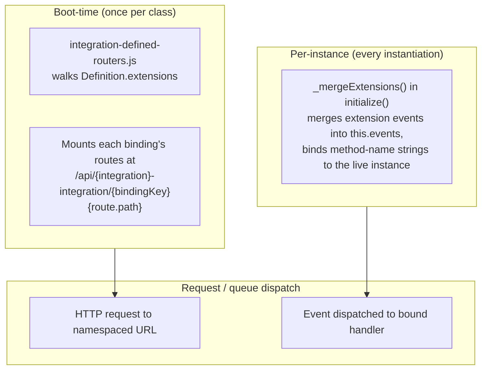

# ADR-018: Integration Extensions

**Status**: Implemented ([PR #590](https://github.com/friggframework/frigg/pull/590) and [PR #596](https://github.com/friggframework/frigg/pull/596)). Authoritative quick-start: [`packages/core/integrations/EXTENSIONS.md`](../../packages/core/integrations/EXTENSIONS.md).
**Date**: 2026-06-09 (decision ratified retroactively)
**Deciders**: Sean Matthews (decision), Daniel Klotz (implementation)

## Context

Many Frigg integrations need the same integration-level patterns: a sync engine, durable workflows, fan-out and fan-in processing, state machines, common user actions, dynamic multi-page configuration, field mapping. Each integration could copy these patterns. Through early 2026 the codebase did exactly that, and the duplication produced drift. The HubSpot integration's webhook receiver behaved subtly differently from Asana's even though both were doing the same thing.

**Integration Extensions** are the bundled-reuse layer at the integration level. An API module or a shared library exports a bundle of routes, events, queues, and workers. An integration class binds the bundle declaratively in its `static Definition.extensions`. The framework merges the bundle's contributions into the integration's effective surface at boot.

## Decision

An **Integration Extension** is an exported bundle of `{ routes, events, queues, workers, useDatabase? }` consumed by an integration class. Bundles are declarative; binding is by name (string method references resolved against the live instance at startup). Routes are namespaced under the binding key so two extensions on the same integration cannot collide on URL.

### Shape (integration side)

```javascript
const hubspot = require('@friggframework/api-module-hubspot');

class HubSpotIntegration extends IntegrationBase {
    static Definition = {
        name: 'hubspot',
        modules: { hubspot: { definition: hubspot.Definition } },
        extensions: {
            hubspotWebhooks: {
                extension: hubspot.extensions.webhooks,
                handlers: { HUBSPOT_WEBHOOK: 'onHubSpotEvent' },
            },
        },
    };

    async onHubSpotEvent({ data }) { /* business logic */ }
}
```

### Shape (api module or shared library side)

```javascript
// @friggframework/api-module-hubspot/extensions/webhooks/index.js
module.exports = {
    name: 'hubspot-webhooks',
    useDatabase: false,
    routes: [{ path: '/webhooks', method: 'POST', event: 'HUBSPOT_WEBHOOK' }],
    events: {
        HUBSPOT_WEBHOOK: { type: 'WEBHOOK', handler: defaultDispatchHandler },
    },
    queues: [ /* ... */ ],
    workers: [ /* ... */ ],
};
```

### Route URL pattern

```
/api/{integration-name}-integration/{bindingKey}{route.path}
```

A HubSpot integration with binding key `hubspot` and extension route `POST /webhooks` mounts at `POST /api/hubspot-integration/hubspot/webhooks`. Two modules' webhook extensions cannot collide because their binding keys differ.

### Event-handler resolution

For an event `EVT` raised by an extension:

1. If the integration's constructor sets `this.events[EVT]`, it wins (and the binding's handler for `EVT` is `console.warn`'d as shadowed)
2. Else if `binding.handlers[EVT]` names a method on the integration, that method is bound and invoked
3. Else the extension's own default `events[EVT].handler` runs
4. Else `initialize()` throws

### `useDatabase` resolution

Each extension declares whether its route handler opens a database connection:

```
binding.useDatabase ?? extension.useDatabase ?? false
```

Default `false` for extension routes. A webhook receiver verifying a signature and enqueueing should not pay for a DB connection. Database-dependent work belongs in the queue worker, not the receiver.

### Fail-loud defaults

- Two bindings sharing an event name throw (events are not namespaced; routes are)
- Two routes with same `method + path` within one binding throw
- Binding handler references a missing method throws
- Binding declares a handler for an event the extension does not expose throws
- Non-boolean `useDatabase` throws

## Architecture



## Patterns in scope for this layer

Beyond the shipped webhook pattern, Integration Extensions are the right home for:

- Sync engines (initial sync, delta sync, reconciliation bundled together)
- Durable workflows (long-running operations with retry, pause, and resume)
- Fan-out and fan-in (partition a large operation across workers, gather, finalize)
- State machines (explicit FSM for integration lifecycle: CONFIGURING, READY, SYNCING, ERROR, RECONCILING)
- Common user actions ("resync all", "pause", "test connection" as bundled `USER_ACTION` events)
- Dynamic multi-page config (config UI that paginates and branches based on prior answers)
- Field mapping (cross-system field mapping UI and persistence)

Each is a candidate for a published extension package.

## Cross-references

- [EXTENSIONS-TAXONOMY](./015-extensions-taxonomy.md): Integration Extensions in context
- [API-MODULE-EXTENSIONS](./019-api-module-extensions.md): Integration Extensions are typically consumed from an API Module Extension (e.g. `hubspot.extensions.webhooks`)
- [INTEGRATION-TEMPLATES](./023-integration-templates.md): templates often pre-wire Integration Extensions for a category (a CRM sync template binds a sync-engine extension)
- [CAPABILITIES](./020-capabilities.md): capabilities can be `implementedBy: { kind: 'extension', ref: 'extensions.webhooks' }`
- Quick-start in code: [`packages/core/integrations/EXTENSIONS.md`](../../packages/core/integrations/EXTENSIONS.md) is authoritative for current shape

## Open questions and deferred items

1. **Per-class merged-event cache.** `_mergeExtensions` re-runs every instantiation. It is a pure function of static definition and is cacheable. Matters for webhook firehoses.
2. **Worker-side consumption of `getExtensionWorkers`.** The helper is exported but `integration-defined-workers.js` is a TODO. Extension events ride the default per-integration queue worker today.
3. **Declarative `route.middleware: []` seam.** Extensions own signature verification but have no declared place for it.
4. **Should extensions be allowed to declare `schedules` and `userActions`?** Both would be high-leverage. Neither is in the contract today.

## References

- PR #590: initial framework load (route and event seams)
- PR #596: route namespacing under binding key, `useDatabase` field
- The `frigg-2.0-prototyping` repo's `backend/src/extensions.js` is the historical sketch this contract derives from
