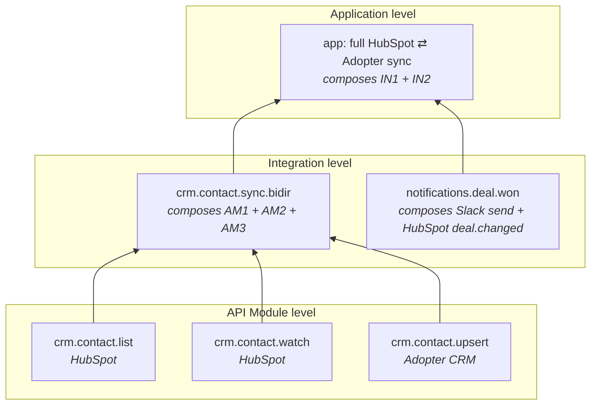

# ADR-020: Capabilities

**Status**: Proposed
**Date**: 2026-06-09
**Deciders**: Sean Matthews

## Context

A Frigg `static Definition` block today carries mechanical metadata (`name`, `version`, `modules`, `routes`, `webhooks`). It does not carry a structured statement of what the piece of Frigg can do. Answering "what does this app, integration, or API module do?" today requires reading the class methods, event registrations, route handlers, and constructor wiring.

Two consumers want a structured answer instead:

1. An agent working on the codebase. Adding a new workflow requires knowing what already exists. The current answer is "read all the source," which is expensive and produces the kind of mistakes that surface in PR review (e.g. declaring four routes for something that should have been one route plus two config options plus one user action).
2. Humans wanting visibility into an app's surface. Dashboards, docs, change-impact analysis, and UI auto-rendering all want a structured answer to "what does this thing expose." Today they reverse-engineer it from code.

This ADR introduces **Capabilities** as a structured surface that serves both.

## Decision

A **Capability** is a typed declaration on a Frigg `Definition` that names a piece of behavior and points at the spec describing it and the code implementing it. The capability is metadata about the code, not the code.

Capabilities exist at three Frigg levels and compose from the level below:

| Level | Lives on | Answers |
|---|---|---|
| **API Module Capabilities** | `apiModule.Definition.capabilities` | What can this provider's API do that has been wired up? (list contacts, watch deal changes, send a message) |
| **Integration Capabilities** | `IntegrationBase.Definition.capabilities` | What workflow does this integration expose? (sync contacts bidirectionally, route inbound webhooks to a destination, surface a dashboard) |
| **Application Capabilities** | `appDefinition.capabilities` | What does the whole app expose? (a top-level view computed from the integrations it loads and any app-level extensions) |

Each capability declares:

- A **name**: stable identifier (`crm.contact.sync`, `notifications.slack.send`)
- A **surface**: the kind of capability (sync, action, webhook, ui, lifecycle, ai-inference, mcp-tool, config, cron)
- A pointer to its **spec**: OpenAPI, AsyncAPI, Arazzo, Fenestra, or a free-form schema reference
- A pointer to its **implementation**: code location, or a reference to a Tier 3 extension, template, or artifact
- Optional **dependencies**: other capabilities (typically lower-level) it composes from

## Two consumers

### Agentic consumption

An agent queries the capability graph instead of reading source. For a task like "add bidirectional contact sync between HubSpot and the adopter's CRM," the resolver returns:

- HubSpot module has capability `crm.contact.list` (spec: `hubspot-openapi#/contacts.list`)
- HubSpot module has capability `crm.contact.watch` (spec: `hubspot-asyncapi#/contact.changed`)
- No adopter-side module exists; the agent scaffolds one using [INTEGRATION-TEMPLATES](./023-integration-templates.md)
- Integration capability `crm.contact.sync.bidir` composes from both modules' capabilities

The [Agent Harness](./025-agent-harness.md) wires this query into session start. The [Ontology](./021-ontology.md) provides the convention layer for interpreting the graph.

### Visibility consumption

The capability graph renders for humans without anyone reading source:

- `GET /api/capabilities` on a deployed Frigg app returns the composed graph (api modules → integrations → app)
- The management UI renders the graph with drill-down to spec and implementation pointers
- Docs generators produce API, integration, and app reference pages from capabilities
- Change-impact analysis flags downstream consumers when a low-level capability changes shape

## Composition across levels



A capability at one level points down to the lower-level capabilities it composes from. The graph is acyclic and queryable bottom-up ("what uses this API module capability?") and top-down ("what does this app expose?").

## Shape (worked example)

API module level:

```javascript
// @friggframework/api-module-hubspot/definition.js
module.exports = {
    name: 'hubspot',
    capabilities: {
        'crm.contact.list': {
            surface: 'data-read',
            spec: { kind: 'openapi', ref: './specs/hubspot-openapi.yaml#/paths/~1crm~1v3~1objects~1contacts/get' },
            implementedBy: { kind: 'api-class-method', ref: 'HubSpotApi.listContacts' },
        },
        'crm.contact.watch': {
            surface: 'webhook-source',
            spec: { kind: 'asyncapi', ref: './specs/hubspot-asyncapi.yaml#/channels/contact.changed' },
            implementedBy: { kind: 'extension', ref: 'extensions.webhooks', extensionEvent: 'CONTACT_CHANGED' },
        },
    },
};
```

Integration level:

```javascript
// in MyIntegration's Definition
capabilities: {
    'crm.contact.sync.bidir': {
        surface: 'sync',
        spec: { kind: 'arazzo', ref: './specs/bidir-sync.arazzo.yaml' },
        implementedBy: { kind: 'template', ref: '@friggframework/integration-templates/sync-bidir' },
        dependsOn: [
            { module: 'hubspot', capability: 'crm.contact.list' },
            { module: 'hubspot', capability: 'crm.contact.watch' },
            { module: 'adopter', capability: 'crm.contact.upsert' },
        ],
    },
},
```

App level capabilities are usually computed (the union of declared integration capabilities) rather than declared explicitly. An app can override or annotate, but the default is the union of what its integrations expose.

## Cross-references

- [PLUGINS](./016-plugins.md): plugins are not capabilities (they swap infrastructure), but capabilities can declare `requires` against plugin types (e.g. a capability that needs an AWS deployment)
- [EXTENSIONS-TAXONOMY](./015-extensions-taxonomy.md), [CORE-EXTENSIONS](./017-core-extensions.md), [INTEGRATION-EXTENSIONS](./018-integration-extensions.md), [API-MODULE-EXTENSIONS](./019-api-module-extensions.md): extensions are referenced by `implementedBy`
- [INTEGRATION-TEMPLATES](./023-integration-templates.md): templates are referenced by `implementedBy` and typically declare the capability set the template promises
- [ARTIFACTS](./022-artifacts.md): artifacts are referenced by `implementedBy` when a capability requires outside-Frigg code (HubSpot Project, Slack manifest)
- [ONTOLOGY](./021-ontology.md): the ontology contains capability naming and surface-kind conventions
- [AGENT-HARNESS](./025-agent-harness.md): the harness compiles and injects the capability graph at session start

## Open questions

1. **Capability namespacing.** `crm.contact.sync.bidir` vs `crm/contact/sync.bidir` vs `crm:contact:sync:bidir`. Lean dot-notation for filesystem-safety and grep-ability.
2. **App-level capability computation.** Always computed from integrations, or sometimes explicitly declared (e.g. for app-level capabilities that don't belong to a single integration, like global webhooks or dashboards)?
3. **Surface enum scope.** Initial set: `sync, data-read, data-write, action, webhook-source, webhook-sink, ui, lifecycle, ai-inference, mcp-tool, config, cron`. Open to additions; closed to free-form strings so the rendering UI can be exhaustive.
4. **Spec-kind enum scope.** Initial set: `openapi, asyncapi, arazzo, fenestra, json-schema, free-form`. Same closed-set treatment.
5. **Versioning.** Do capabilities carry their own version, or inherit from their parent Definition's version?

## References

- Mike Amundsen's writing on the API resource graph as the unit of agent reasoning
- The OpenAPI, AsyncAPI, and Arazzo specs that capabilities point at
- ShadCN's component-ownership philosophy, applied at the capability level
