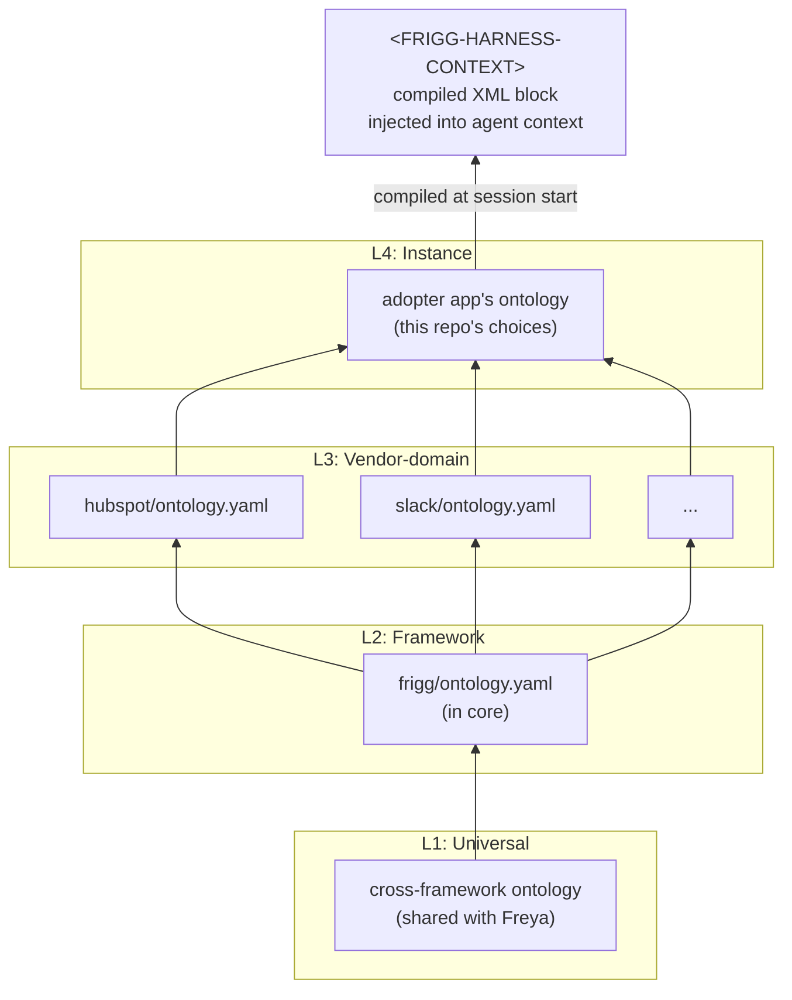

# ADR-021: Ontology

**Status**: Proposed
**Date**: 2026-06-09
**Deciders**: Sean Matthews

## Context

When an agent reads a Frigg codebase to add or modify an integration, it needs the conventions and locked constraints that govern that codebase in addition to the code itself. Examples: "routes go through capabilities, not raw HTTP handlers"; "field-level encryption is mandatory for credential fields"; "API module vocabulary is provider-specific, core is platform-neutral." These rules do not live in any single file. They live in patterns across the repo, in PR review history, and in the heads of senior contributors.

CLAUDE.md files capture some of this. They have limitations: a single flat surface per repo, no composition across the framework, vendor, and instance boundaries, no versioning, no schema or validator for authoring, and an ongoing sync cost.

The **Ontology** is a structured alternative: layered, typed, versioned context that compiles on demand into the XML-tagged blocks an agent sees at session start.

## Decision

A Frigg ontology is a stack of four layers, each progressively more specific:

| Layer | Scope | Authored by | Examples |
|---|---|---|---|
| **L1 (Universal)** | Cross-framework conventions | Cross-framework working group (with Freya) | "Capability declarations point at specs and implementations." "Friction is captured to a shared `@freyaframework/friction` log." |
| **L2 (Framework)** | Frigg conventions, locked constraints | Frigg core maintainers | "Routes ride [Capabilities](./020-capabilities.md), not raw handlers." "Credentials use field-level encryption." "Provider-vocabulary helpers belong in API Module Extensions." |
| **L3 (Vendor-domain)** | Per-API-module conventions | API module authors (shipped with the module) | "HubSpot signature verification uses v3 URL-signing." "Salesforce credential refresh requires `apiPropertiesToPersist` for sandbox vs prod." |
| **L4 (Instance)** | This specific Frigg app | The adopter | "This app uses Aurora Postgres." "Multi-tenant: every webhook receiver looks up portalId to integrationId." |

Layers compose bottom-up at session start. Higher layers override or refine lower ones. The compiled result is a single XML-tagged context block (`<FRIGG-HARNESS-CONTEXT>...</FRIGG-HARNESS-CONTEXT>`) injected by the [Agent Harness](./025-agent-harness.md).

### Module-exported ontology

Each API module ships its own L3 fragment alongside its Definition:

```yaml
# @friggframework/api-module-hubspot/ontology.yaml
version: 1
layer: L3
domain: hubspot
conventions:
  - id: hubspot.webhooks.signature
    rule: "Always verify x-hubspot-signature-v3 against the full URL + body before processing"
    rationale: "HubSpot's signature scheme includes the full URL, so any path change breaks verification"
  - id: hubspot.portalid.lookup
    rule: "Resolve portalId to integrationId via findIntegrationByEntityExternalId(portalId, 'hubspot')"
    rationale: "Cross-tenant routing guard: multiple integrations with the same portalId throws"
locked-constraints:
  - id: hubspot.oauth.scope.read
    rule: "OAuth requires 'oauth' scope minimum even for read-only flows"
```

When the harness compiles the L3 layer for a Frigg app that has the HubSpot API module installed, it pulls in `hubspot/ontology.yaml` along with any other module's ontology files. Modules manage their own conventions; the compiler aggregates them.

## Architecture



Composition is additive: each higher layer adds or overrides conventions from the layer below. Conflicts are resolved by higher-layer-wins, with a `console.warn` from the compiler.

## Session protocol

At session start, the [Agent Harness](./025-agent-harness.md):

1. Walks the four layers in order (L1, L2, L3, L4)
2. Compiles them into a single ontology object
3. Renders the object as an XML-tagged block
4. Injects the block as part of the agent's system context

For a subagent spawn, the harness re-runs steps 3 and 4. The compiled object is cached per session. Validation subagents get the same block. Friction is logged against the block's version SHA.

## Validation subagent pattern

The recommended use of the ontology by an agent:

1. Agent reaches a decision point (e.g. designing a new webhook receiver)
2. Agent spawns a validation subagent with the ontology block and the proposed design
3. Validation subagent checks the design against L1–L4 conventions and locked constraints
4. Validation subagent returns findings; parent agent corrects or proceeds

This is one of the three interventions tested in the [Evals](./026-evals.md) precursor.

## Friction capture and ontology evolution

When an agent encounters a question the ontology should have answered but did not, it logs a friction event to the shared `@freyaframework/friction` package (see [ADR-AGENT-HARNESS](./025-agent-harness.md) for cross-framework alignment with Freya). Friction events are triaged into PR proposals against the relevant ontology layer.

The ontology fills its own gaps from real agent traces rather than from anyone enumerating every constraint up front.

## Cross-references

- [AGENT-HARNESS](./025-agent-harness.md): the harness compiles, injects, and propagates the ontology
- [CAPABILITIES](./020-capabilities.md): capability naming and surface-kind conventions live in the L2 ontology
- [INTEGRATION-TEMPLATES](./023-integration-templates.md): templates may declare their own ontology fragment for adopter-specific conventions
- [EVALS](./026-evals.md): measures whether ontology injection improves agent output

## Open questions

1. **Ontology schema.** Is the YAML shape above the right schema? JSON Schema for validation, YAML for authoring. Lean: yes.
2. **Versioning across layers.** L2 conventions change as the framework evolves; L3 conventions change as APIs evolve. How are L4 ontologies pinned against compatible L2 and L3 versions? Lean: SemVer per layer; instance pins its supported range.
3. **Conflict resolution beyond higher-layer-wins.** What if L4 wants to relax a locked constraint from L2? Lean: not allowed for locked constraints; allowed for conventions with explicit override declaration.
4. **Compiler language.** Node (for portability with the rest of Frigg) or Python (richer YAML and JSON-Schema tooling)? Lean: Node.
5. **Source adapters beyond YAML.** Markdown frontmatter? Embedded in capability declarations? Lean: YAML primary; markdown supported via frontmatter for adopters who prefer prose.

## References

- Freya ADR-008 and ADR-009: the cross-framework patterns this ADR borrows from
- The L1–L4 layer model was inspired by similar tiering in domain-driven-design ontology work
