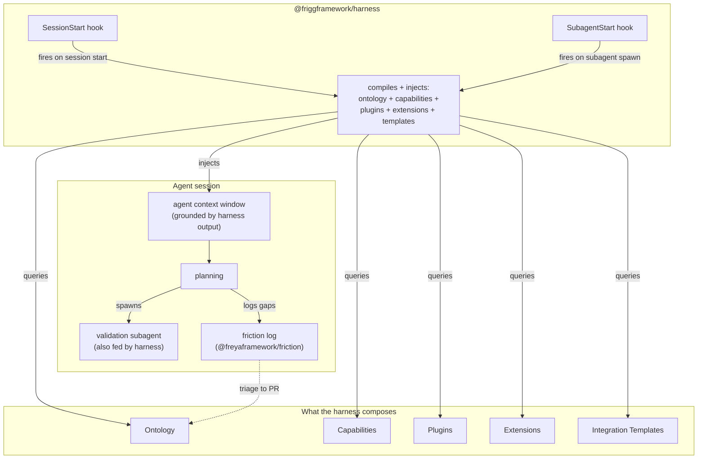

# ADR-025: Agent Harness

**Status**: Proposed
**Date**: 2026-06-09
**Deciders**: Sean Matthews

## Context

Adding a new integration to a Frigg app is a multi-step process: discover the two systems, install or write API modules, author the integration class, configure sync, define mapping, scaffold tests, wire CD. An existing skill encodes this as a 10-phase orchestration and is the primary path agents use for integration work today.

The skill on its own cannot ground itself in a specific Frigg app's conventions, query existing capabilities before proposing new ones, validate its plan against locked constraints, or capture friction when the conventions fall short. The **Agent Harness** addresses those needs by giving the skill (and any other agent doing Frigg work) a structured runtime to operate inside.

The goal is a structured flow that produces testable agentic outcomes.

## Decision

The Agent Harness is a `@friggframework/harness` package that wires four other Frigg concepts into Claude Code's session lifecycle so agents working on a Frigg codebase can ground, plan, validate, and evolve. The harness is one of five composing pieces:

```
agent + CLI + harness + templates + capabilities → predictable, testable, validated, scaffolded integrations
```

| Piece | Contribution |
|---|---|
| Agent (LLM inference) | Reasoning, code generation, planning |
| CLI (`frigg` commands) | Deterministic actions: scaffold, install, deploy, test |
| Harness | Session wiring: inject ontology, query capabilities, spawn validators, log friction |
| [Integration Templates](./023-integration-templates.md) | ShadCN-mirror starting points the agent copies and customizes |
| [Capabilities](./020-capabilities.md) | Machine-readable model of what exists and what can be added |

The harness on its own does nothing. It is the composition layer that brings the other four into the agent's session. With all five in place, the agent's remaining work is the finishing portion: adopter-specific API mapping, business logic, edge cases.

### Worked example: adding a Slack notification integration

```
1. agent enters session
2. harness SessionStart compiles ontology, capabilities, installed plugins/extensions/templates
   and injects <FRIGG-HARNESS-CONTEXT> block into agent context
3. agent reads the goal: "add Slack notifications when a deal closes in HubSpot"
4. agent queries capabilities, confirms HubSpot has crm.deal.watch and Slack has notifications.message.send
5. agent queries templates, matches notification-fanout-template for the integration shape
6. CLI: frigg add template notification-fanout --partner slack --source hubspot --name DealClosedNotifications
7. template scaffolds the integration class into backend/src/integrations/DealClosedNotifications/
8. agent spawns validation subagent, which checks plan against ontology (signature verification,
   useDatabase, capability declaration)
9. agent writes adopter-specific routing logic (which Slack channel, what message template)
10. agent runs `frigg auth test .` against the new Slack module to confirm wiring
11. tests scaffolded by template run green
12. agent logs friction (if any conventions were unclear or missing) to @freyaframework/friction
13. PR opened
```

The harness is responsible for steps 2, 4, 5, 8, and 12. Without it, the agent does those by reading source, guessing, or skipping.

## Architecture



## Implementation

The harness package exposes two Claude Code hooks:

- **SessionStart**: runs once when the agent's session begins. Reads `appDefinition`, walks installed API modules, compiles the ontology and capability graph, renders the result as XML-tagged blocks, returns them as additional system context.
- **SubagentStart**: runs each time the parent agent spawns a subagent. Re-injects the same compiled context (cached per session by SHA).

```javascript
// .claude/hooks/session-start.js (generated by `frigg harness init`)
const { compileHarnessContext } = require('@friggframework/harness');

module.exports = async ({ workingDirectory }) => {
    const ctx = await compileHarnessContext({ cwd: workingDirectory });
    return {
        systemContext: ctx.xml,  // <FRIGG-HARNESS-CONTEXT>...</FRIGG-HARNESS-CONTEXT>
        metadata: { contextSha: ctx.sha, layers: ctx.layers },
    };
}
```

Friction capture is a separate small surface: `friction.log(event)` appends to `.frigg/friction/<session-id>.jsonl`, which a daily job triages into PR proposals against the [Ontology](./021-ontology.md) layers.

The hook wiring, compiler internals, and friction storage shape are implementation details. The hooks should be replaceable with MCP server equivalents without changing the five-piece composition above.

## Cross-references

- [CAPABILITIES](./020-capabilities.md), [ONTOLOGY](./021-ontology.md), [INTEGRATION-TEMPLATES](./023-integration-templates.md), [PLUGINS](./016-plugins.md), [EXTENSIONS-TAXONOMY](./015-extensions-taxonomy.md): the five pieces the harness composes
- [EVALS](./026-evals.md): measures whether the composed harness output is better than agent-alone

## Open questions

1. **Hook vs MCP server.** Today this assumes Claude Code's hook system. Should the harness also expose itself as an MCP server so non-Claude-Code agents (Cursor, Aider, custom orchestrators) can consume the same compiled context? Lean: yes, as a follow-up; hooks first.
2. **Cache invalidation.** The compiled context is keyed by source SHA. When source changes mid-session, what triggers recompile? Lean: stale-on-read, recompile on next subagent spawn.
3. **Plugin and extension introspection cost.** Walking installed packages at session start has a latency cost. Lean: under 500ms for a typical Frigg app with 5 to 10 modules; benchmark before committing to "every session."
4. **Subagent context size.** Re-injecting the full compiled block on every subagent spawn could exceed context budgets in long sessions. Pre-compute deltas?
5. **Versioning the harness against the framework.** Harness v1 must work against framework v2.x. How is the compatibility range pinned?

## References

- Freya ADR-008 and ADR-009: lifecycle taxonomy and cross-framework patterns this ADR builds on
