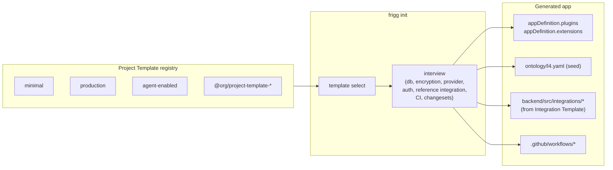

# ADR-028: App Init

**Status**: Proposed
**Date**: 2026-09-27
**Deciders**: Sean Matthews

## Context

The other ADRs in this set describe what you build *inside* a Frigg app: plugins, extensions, integrations, capabilities, templates, artifacts. None of them describe how a Frigg app comes into existence.

`frigg init` today produces a minimal scaffold. Adopters routinely then hand-configure the shape they actually want (which database plugin, which encryption method, which core extensions, which starter integrations, which L4 ontology conventions). Every adopter does the same setup by hand. Issue [#595](https://github.com/friggframework/frigg/issues/595) tracks the gap and flags the vestigial `--template` flag on the current implementation.

**Project Templates** are distinct from [Integration Templates](./023-integration-templates.md). Integration Templates are per-category base classes an adopter copies into an existing app. Project Templates initialize the app itself.

## Decision

`frigg init` produces a Frigg app from a named **Project Template** plus an interactive interview that scaffolds overrides. The output is a working project with the adopter's plugin choices, seeded core extensions, seeded L4 ontology, and (optionally) a first reference integration.

### Project Template registry (initial set)

| Template | Posture | Use case |
|---|---|---|
| `minimal` | Bare skeleton. AWS provider, in-memory queue, no extensions, no reference integration. | Learning, experimentation |
| `production` | Postgres + KMS + private VPC + EventBridge scheduler + audit-log Core Extension + agent-frigg-claude Core Extension. Reference integration scaffolded. | Adopter shipping to prod |
| `agent-enabled` | Production posture plus MCP-server Core Extension, harness pre-configured, adopter skill and agent scaffolding under `.claude/`. | Adopter running agents against the codebase from day one |

Adopters can publish additional templates under `@friggframework/project-template-*` or `@<org>/project-template-*`. The registry is the same convention as [PLUGINS](./016-plugins.md) (`@friggframework/provider-*` etc).

### Interview

After template selection, `frigg init` walks the adopter through the choices that a template cannot pre-decide. Each answer writes into the generated `appDefinition`:

| Question | Writes to |
|---|---|
| Database (Postgres / Mongo / DocumentDB / SQLite) | `plugins.database.kind` |
| Encryption (KMS / AES) | `plugins.encryption.kind` |
| Deploy target (AWS / Netlify / Vercel / GCP) | `plugins.provider.kind` |
| Auth modes (friggToken / sharedSecret / password / SSO) | `user.authModes` |
| Reference integration (skip / one from a menu / a partner-you-name) | Adds an [Integration Template](./023-integration-templates.md) copy under `backend/src/integrations/` |
| CI provider (GitHub Actions / none) | `.github/workflows/*` files |
| Changesets on/off | `.changeset/config.json` |

Non-interactive mode: `frigg init --template production --answers answers.yaml` runs the same flow from a file. Both modes produce an identical result.

### L4 ontology seed

The init flow writes a starter `ontology/l4.yaml` derived from the interview answers. Example:

```yaml
version: 1
layer: L4
domain: my-app
conventions:
  - id: my-app.db
    rule: "This app uses Aurora Postgres"
    rationale: "Selected at init time"
  - id: my-app.auth-modes
    rule: "friggToken and sharedSecret are enabled; adopter apps must send x-frigg-api-key or a bearer JWT"
```

The seed is a small starting point. Adopters add to it over time as their conventions crystallize. See [ADR-021: Ontology](./021-ontology.md).

## Shape (worked example)

```bash
$ frigg init my-frigg-app --template production
✓ Copying production template into ./my-frigg-app/
? Database                         › Aurora Postgres
? Encryption                       › AWS KMS (recommended for production)
? Deploy target                    › AWS
? Auth modes                       › friggToken, sharedSecret
? Add a reference integration?     › Yes, HubSpot ↔ my adopter API (crm-sync-bidir)
? CI provider                      › GitHub Actions
? Changesets                       › Enable
✓ Wrote appDefinition to backend/index.js
✓ Wrote L4 ontology seed to ontology/l4.yaml
✓ Scaffolded reference integration at backend/src/integrations/HubspotSync/
✓ Wrote CI workflows to .github/workflows/
✓ Ran npm install
✓ Ran `frigg auth test .` on scaffolded modules. All pass.
ℹ Next: map your adopter API in backend/src/integrations/HubspotSync/mapping.js
```

## Architecture



## Cross-references

- [PLUGINS](./016-plugins.md): interview answers write into `plugins.*` selections
- [CORE-EXTENSIONS](./017-core-extensions.md): Project Templates preload zero or more Core Extensions
- [INTEGRATION-TEMPLATES](./023-integration-templates.md): reference integration option delegates to Integration Templates
- [ONTOLOGY](./021-ontology.md): the L4 seed is a starting point for adopter-owned conventions
- [SKILLS](./029-skills.md): agent-enabled template scaffolds `.claude/` with a starter skill and agent set

## Open questions

1. **Template distribution.** npm package (`@friggframework/project-template-production`) vs git URL (`--template github:org/repo`) vs both? Lean: npm primary, git URL supported for org-private templates.
2. **Template inheritance.** Can `agent-enabled` be defined as `production` + a delta, or must every template be self-contained? Lean: self-contained; delta introduces a compatibility matrix.
3. **Interview UX.** JSON Schema form (like `frigg auth test`) vs inquirer prompts? Lean: JSON Schema for consistency with the rest of the CLI.
4. **Re-run behavior.** `frigg init` in an existing directory: error, refuse, or `--reconfigure` to update overrides without touching custom code? Lean: refuse unless `--reconfigure` is passed.
5. **The vestigial `--template` flag.** The current implementation has a `-t, --template` option that falls through to a "Legacy template system is no longer supported" error path (issue #595). Remove it, or repurpose it to select from the new registry? Lean: repurpose.

## References

- Issue [#595](https://github.com/friggframework/frigg/issues/595): the proposal that motivated this ADR
- Issue [#594](https://github.com/friggframework/frigg/issues/594): related docs drift on the CLI command list
- Existing production Frigg projects at adopters have converged on a common posture (Postgres + KMS + VPC + EventBridge + Changesets + GitHub Actions). That converged shape is the prior art for the `production` Project Template proposed here.
