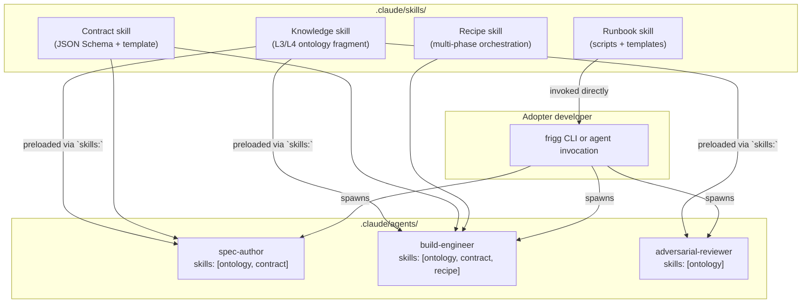

# ADR-029: Skills

**Status**: Proposed
**Date**: 2026-09-27
**Deciders**: Sean Matthews

## Context

Adopter Frigg apps that use agents (Claude Code, Cursor, custom orchestrators) ship a `.claude/skills/` directory alongside `.claude/agents/`. Skills are the read-on-demand knowledge, contracts, and runbooks that agents load into context. The [ADR-025: Agent Harness](./025-agent-harness.md) proposes a runtime hook that injects compiled ontology + capability data at session start. Skills are the complementary declarative surface: knowledge and procedures the agent can load explicitly when relevant.

An adopter repo that uses Frigg for repeated CRM integration authoring has an in-production skill layer with three sub-agents and five skills. Reading its actual files surfaces a distinction the current ADR set does not name: skills have distinct subtypes with different lifecycles and different authoring roles. Bundling them under one word obscures which pattern applies when.

## Decision

A **Skill** is a Markdown-fronted directory under `.claude/skills/<name>/` containing a `SKILL.md` with YAML frontmatter (`name`, `description`, optional `user-invocable`, optional `argument-hint`) plus supporting files. Skills are one of four subtypes:

| Subtype | What it contains | Example | Loaded by |
|---|---|---|---|
| **Knowledge skill** | Reference material (an L3 or L4 [Ontology](./021-ontology.md) fragment). Ref files per stage. Hard rules. Gotchas. Gold-standard exemplars. | `{adopter}-integration-ontology` | Any agent, preloaded via `skills:` frontmatter |
| **Contract skill** | JSON Schema + template + validator. The machine-checkable shape of a handoff artifact. | `{adopter}-spec-contract` | Producer and consumer agents in a pipeline |
| **Runbook skill** | Human-executable procedure. Scripts, templates, step-by-step. | `{adopter}-test-integration`, `{adopter}-changeset` | User or agent per-invocation |
| **Recipe skill** | Multi-phase orchestration with embedded knowledge and procedure. | `frigg-create-integration` | User or top-level agent |

### The `user-invocable` flag

Skills default to user-invocable. Set `user-invocable: false` in frontmatter to hide the skill from user-facing lists. Sub-agent-only knowledge and contract skills should set this so they do not appear as CLI options; they exist as agent preload material only.

### Skill-to-agent preloading

A sub-agent declares which skills to preload via the `skills:` field in its frontmatter:

```yaml
---
name: spec-author
description: Authors an integration spec from a third-party API's docs.
tools: Read, Grep, Glob, WebFetch, Write, Bash
model: opus
skills:
  - {adopter}-integration-ontology
  - {adopter}-spec-contract
  - frigg
---
```

The framework loads the referenced skills' `SKILL.md` and any explicitly-referenced reference files into the agent's context at spawn time. Reference files under the skill's directory (`reference/*.md`) are read on demand by the agent, not eagerly loaded.

This declarative form is a valid alternative to the [Agent Harness](./025-agent-harness.md) hook for grounding an agent. The harness compiles a merged ontology + capability graph at session start; `skills:` frontmatter loads specific named skills at agent spawn. Both mechanisms coexist. The harness handles cross-cutting context; `skills:` handles agent-specific bundles.

## Shape (worked example)

Directory layout for the four subtypes:

```
.claude/skills/
├── {adopter}-integration-ontology/          # knowledge skill
│   ├── SKILL.md                        # user-invocable: false
│   └── reference/
│       ├── base-crm-integration.md
│       ├── api-module.md
│       ├── gotchas-checklist.md
│       ├── hcp-gold-standard.md
│       ├── house-style.md
│       └── {vendor}-module.md
├── {adopter}-spec-contract/                  # contract skill
│   ├── SKILL.md                        # user-invocable: false
│   ├── schema/spec.schema.json         # the JSON Schema
│   └── templates/spec-template.md      # a human-readable render template
├── {adopter}-test-integration/               # runbook skill
│   ├── SKILL.md                        # argument-hint: "[spec-path] [local|dev]"
│   ├── scripts/run-lifecycle.sh
│   └── templates/test-report.template.json
└── frigg-create-integration/           # recipe skill
    ├── SKILL.md
    ├── assets/
    └── references/
```

## Architecture



## Authoring guidance for adopters

When authoring a skill layer for a new adopter app:

1. **Start with the knowledge skill** (`<adopter>-integration-ontology`). Capture framework contract facts, house style, gotchas, and a gold-standard exemplar. This is the L3+L4 [Ontology](./021-ontology.md) fragment.
2. **Add the contract skill** (`<adopter>-spec-contract`) if you have a repeated authoring flow that hands off between phases (scoping → building → testing). Ship the JSON Schema, a template, and a validator.
3. **Add runbook skills** for procedures the human runs directly (`<adopter>-test-integration`, `<adopter>-changeset`, `<adopter>-deploy`).
4. **Compose sub-agents** in `.claude/agents/` that reference the skills via `skills:` frontmatter. See [ADR-030: Agent Pipeline](./030-agent-pipeline.md).

## Cross-references

- [ONTOLOGY](./021-ontology.md): knowledge skills are the concrete surface for L3 and L4 ontology fragments
- [CAPABILITIES](./020-capabilities.md): a contract skill can be the JSON Schema that a capability's `spec.ref` points at
- [AGENT-HARNESS](./025-agent-harness.md): harness compiles cross-cutting context; `skills:` frontmatter loads agent-specific bundles. Complementary.
- [AGENT-PIPELINE](./030-agent-pipeline.md): pipelines are composed from sub-agents that preload skills
- [APP-INIT](./028-app-init.md): the `agent-enabled` Project Template scaffolds a starter skill layer

## Open questions

1. **Skill discovery convention.** `@friggframework/skill-*` packages? Both npm and in-repo `.claude/skills/`? Lean: both, with in-repo taking precedence when both are present.
2. **Skill versioning.** Do skills carry their own version, or inherit from the package that ships them? Lean: inherit; skills change with the framework or adopter code they document.
3. **Reference-file eager vs lazy loading.** `SKILL.md` loads eagerly at agent spawn; `reference/*.md` reads on demand. Is that the right split, or should some reference files also load eagerly? Lean: current split.
4. **Contract-skill validators.** Do contract skills ship a Node validator, a JSON Schema alone, or both? Lean: schema is authoritative; validator is a convenience.
5. **Cross-adopter skill reuse.** If ten adopter apps end up shipping similar `<adopter>-changeset` runbook skills, should the common shape move into a shared `@friggframework/skill-changeset`? Lean: yes, once three adopters converge on the same shape.

## References

- An adopter repo running the pattern in production has five skills (one knowledge, one contract, three runbook / recipe) and three sub-agents. The five-skill, three-agent shape is the reference implementation for this pattern.
- Anthropic's Claude Code documentation on skills and agents is the framework this ADR builds on.
