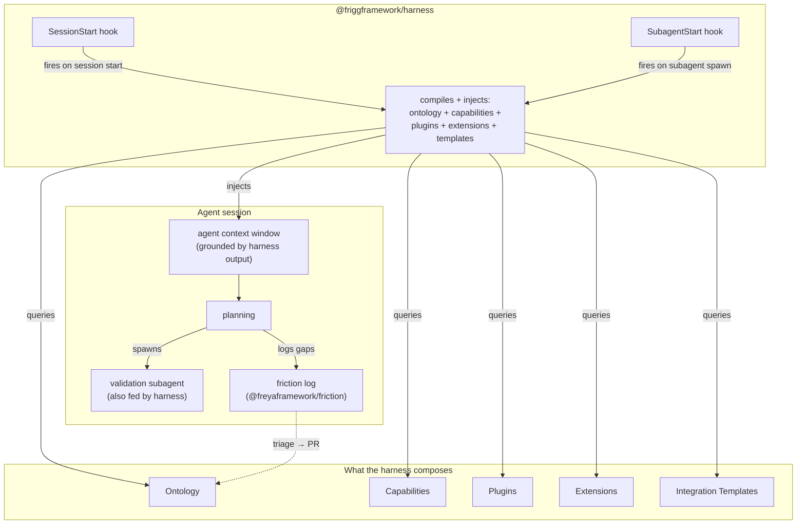

# Architecture Decision Record: Agent Harness

**Status**: Proposed (rewrite of [ADR-AGENT-HARNESS](./ADR-AGENT-HARNESS.md), now deleted)
**Date**: 2026-06-09
**Author**: Sean Matthews

## Context

Adding a new integration to a Frigg app today is a multi-step recipe — discover the two systems, install or write API modules, author the integration class, configure sync, define mapping, scaffold tests, wire CD. Daniel's `frigg-create-integration` skill at `lefthookhq/lefthook--dev-toolkit` encodes this recipe as a 10-phase orchestration; it's load-bearing.

What the skill *can't* do alone: ground itself in this specific Frigg app's conventions, query existing capabilities before proposing new ones, validate its plan against locked constraints, capture friction when the conventions fall short. Those needs are what the **Agent Harness** addresses — not by replacing the skill, but by giving it (and any other agent doing Frigg work) a structured runtime to operate inside.

The intent isn't "a clever hook system." The intent is: **a structured flow that produces testable agentic outcomes**.

## Decision

The Agent Harness is a `@friggframework/harness` package that wires four other Frigg concepts into Claude Code's session lifecycle so agents working on a Frigg codebase can ground, plan, validate, and evolve. The harness is one of five pieces; alone it does nothing.

### The five-piece mechanism

```
agent + CLI + harness + templates + capabilities → predictable, testable, validated, scaffolded integrations
```

| Piece | What it contributes |
|---|---|
| **Agent** (LLM inference) | Reasoning, code generation, planning |
| **CLI** (`frigg` commands) | Deterministic actions — scaffold, install, deploy, test |
| **Harness** | Session wiring — inject ontology, query capabilities, spawn validators, log friction |
| **[Integration Templates](./ADR-INTEGRATION-TEMPLATES.md)** | ShadCN-mirror starting points the agent copies and customizes |
| **[Capabilities](./ADR-CAPABILITIES.md)** | The machine-readable model of what exists and what can be added |

A well-tuned harness composing these five lets an agent quickly and efficiently add new working code and integrations that are *predictable* (the recipe is consistent), *testable* (templates ship tests), *validated* (validation subagent catches drift), and *scaffolded* (templates + CLI handle the boilerplate). The agent's remaining work is the finishing touches — adopter-specific API mapping, business logic, edge cases.

### Worked example: adding a Slack notification integration

```
1. agent enters session
2. harness SessionStart → compiles ontology, capabilities, installed plugins/extensions/templates
   → injects <FRIGG-HARNESS-CONTEXT> block into agent context
3. agent reads the goal ("add Slack notifications when a deal closes in HubSpot")
4. agent queries capabilities → confirms HubSpot has crm.deal.watch, Slack has notifications.message.send
5. agent queries templates → matches notification-fanout-template for the integration shape
6. CLI: `frigg add template notification-fanout --partner slack --source hubspot --name DealClosedNotifications`
7. template scaffolds the integration class into backend/src/integrations/DealClosedNotifications/
8. agent spawns validation subagent → checks plan against ontology (signature verification, useDatabase, capability declaration)
9. agent writes adopter-specific routing logic (which Slack channel? what message template?)
10. agent runs `frigg auth test .` against the new Slack module → confirms wiring
11. tests scaffolded by template run green
12. agent logs friction (if any conventions were unclear or missing) to @freyaframework/friction
13. PR opened
```

The harness is the connective tissue making steps 2, 4, 5, 8, 12 actually happen — without it, the agent does all of those by reading source, guessing, or skipping.

## Architecture



## Implementation (the HOW, not the WHY)

The harness package exposes two Claude Code hooks:

- **SessionStart** — runs once when the agent's session begins. Reads `appDefinition`, walks installed API modules, compiles the ontology + capability graph, renders the result as XML-tagged blocks, returns them as additional system context.
- **SubagentStart** — runs each time the parent agent spawns a subagent. Re-injects the same compiled context (cached per session by SHA).

```javascript
// .claude/hooks/session-start.js (generated by `frigg harness init`)
const { compileHarnessContext } = require('@friggframework/harness');

module.exports = async ({ workingDirectory }) => {
    const ctx = await compileHarnessContext({ cwd: workingDirectory });
    return {
        systemContext: ctx.xml,  // <FRIGG-HARNESS-CONTEXT>…</FRIGG-HARNESS-CONTEXT>
        metadata: { contextSha: ctx.sha, layers: ctx.layers },
    };
}
```

Friction capture is a separate small surface — `friction.log(event)` appends to `.frigg/friction/<session-id>.jsonl`, which a daily job triages into PR proposals against the [Ontology](./ADR-ONTOLOGY.md) layers.

The implementation details (hook wiring, compiler internals, friction storage shape) are *how* the harness works; the *why* is the five-piece composition above. The hooks should be replaceable (e.g. with MCP server equivalents) without changing the conceptual story.

## Cross-references

- [CAPABILITIES](./ADR-CAPABILITIES.md), [ONTOLOGY](./ADR-ONTOLOGY.md), [INTEGRATION-TEMPLATES](./ADR-INTEGRATION-TEMPLATES.md), [PLUGINS](./ADR-PLUGINS.md), [EXTENSIONS-TAXONOMY](./ADR-EXTENSIONS-TAXONOMY.md) — the five pieces the harness composes
- [EVALS](./ADR-EVALS.md) — measures whether the composed harness output is actually better than agent-alone
- Daniel's `frigg-create-integration` skill at `lefthookhq/lefthook--dev-toolkit/skills/` — the 10-phase recipe the harness wraps

## Open questions

1. **Hook vs MCP server.** Today this assumes Claude Code's hook system. Should the harness *also* expose itself as an MCP server so non-Claude-Code agents (Cursor, Aider, custom orchestrators) can consume the same compiled context? Lean: yes, as a follow-up; hooks-first.
2. **Cache invalidation.** The compiled context is keyed by source SHA; when source changes mid-session, what triggers recompile? Lean: stale-on-read, recompile on next subagent spawn.
3. **Plugin / extension introspection cost.** Walking installed packages at session start has a latency cost. Worst case? Lean: <500ms for a typical Frigg app with 5–10 modules; benchmark before committing to "every session."
4. **Subagent context size.** Re-injecting the full compiled block on every subagent spawn could blow context budgets in long sessions. Pre-compute deltas?
5. **Versioning the harness against the framework.** Harness v1 must work against framework v2.x; how is the compatibility range pinned?

## References

- [ADR-AGENT-HARNESS](./ADR-AGENT-HARNESS.md) — the prior, longer version of this ADR (deleted in this rework)
- The "structured flow for testable agentic outcomes" framing from the call with Daniel (2026-06-09)
- Freya ADR-008 / ADR-009 — lifecycle taxonomy + cross-framework patterns this ADR builds on
