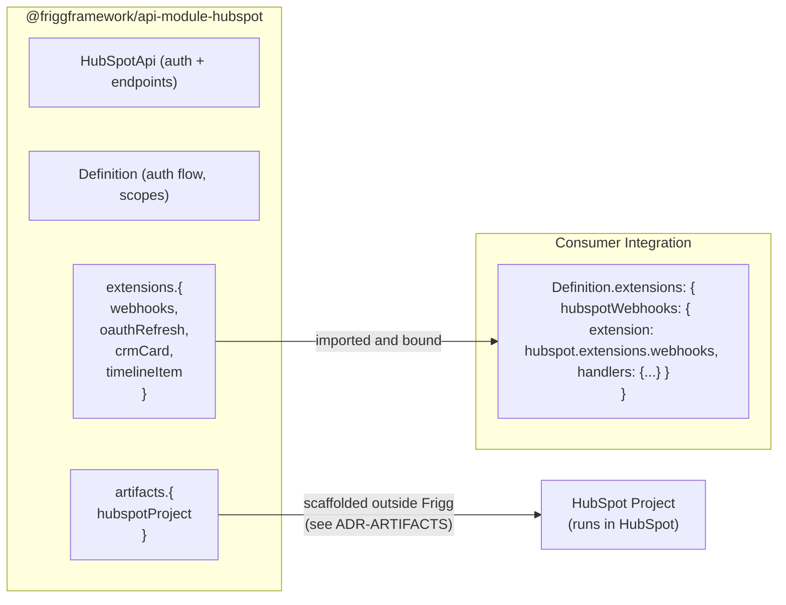

# Architecture Decision Record: API Module Extensions

**Status**: Proposed (Tier 3 mechanism shipped; this ADR formalizes the api-module-side authoring story)
**Date**: 2026-06-09
**Author**: Sean Matthews

## Context

[Integration Extensions](./ADR-INTEGRATION-EXTENSIONS.md) describes the *consumer* side: an integration class binds an extension bundle and gets routes, events, queues, and workers merged into its surface. This ADR describes the *producer* side: how an API module ships those bundles.

An API module is the typed wrapper around one external provider's API (HubSpot, Slack, Asana, Salesforce). Provider-specific concerns — webhook signature schemes, OAuth refresh quirks, rate limits, paginated listing — belong in the API module, not in every integration that uses it. **API Module Extensions** are the namespace where an API module exposes these bundled patterns for any integration to consume.

## Decision

An **API Module Extension** is an extension bundle exported on an API module's exports under `extensions.{name}`. The extension is the same shape consumed by an Integration Extension binding (`{ name, routes, events, queues, workers, useDatabase? }`), authored with provider-specific concerns baked in.

### Shape (exported by the API module)

```javascript
// @friggframework/api-module-hubspot/index.js
module.exports = {
    Definition: require('./definition'),
    Api: require('./api'),
    extensions: {
        webhooks: require('./extensions/webhooks'),
        oauthRefresh: require('./extensions/oauth-refresh'),
        crmCard: require('./extensions/crm-card'),
        timelineItem: require('./extensions/timeline-item'),
    },
    artifacts: { /* see ADR-ARTIFACTS */ },
};
```

```javascript
// @friggframework/api-module-hubspot/extensions/webhooks/index.js
module.exports = {
    name: 'hubspot-webhooks',
    useDatabase: false,
    routes: [
        { path: '/webhooks', method: 'POST', event: 'HUBSPOT_WEBHOOK' },
    ],
    events: {
        HUBSPOT_WEBHOOK: {
            type: 'WEBHOOK',
            handler: async ({ data, integration }) => {
                // HubSpot-specific signature verification baked in
                verifyHubspotV3Signature(data.headers, data.body, integration);
                const portalId = data.body.portalId;
                const resolved = await integration.commands.findIntegrationByEntityExternalId(portalId, 'hubspot');
                return queueDispatch(resolved.integrationId, data.body);
            },
        },
    },
    helpers: {
        // Provider-vocabulary wrappers around platform-neutral primitives
        findIntegrationByPortalId: (portalId) => findIntegrationByEntityExternalId(portalId, 'hubspot'),
    },
};
```

### What belongs in an API Module Extension vs in core

This is the line worth drawing carefully:

| Belongs in API Module Extension | Belongs in core |
|---|---|
| HubSpot v3 webhook signature verification | Signature-verification *interface* / pluggable middleware seam |
| `findIntegrationByPortalId(portalId)` (HubSpot vocabulary) | `findIntegrationByEntityExternalId(externalId, moduleName?)` (platform-neutral) |
| Slack Events API rate-limit handling | Generic rate-limit / retry primitives |
| HubSpot timeline-item POST payload shape | Generic structured-API-call primitives |
| Provider-specific OAuth refresh quirks (refresh-without-rotate, refresh-with-rotate, etc.) | OAuth2 refresh state machine |

**Rule of thumb**: if you can name the thing in a single platform's vocabulary, it belongs in that platform's API Module Extension. If you can name it generically across platforms, it belongs in core.

This shows up most clearly in helpers: `findIntegrationByPortalId` is HubSpot-vocabulary and belongs in `@friggframework/api-module-hubspot/extensions/webhooks/helpers.js`; the core operation is `findIntegrationByEntityExternalId`. Every platform's webhook layer will reach for a similarly-named helper (`findIntegrationByTeamId` for Slack, `findIntegrationByWorkspaceId` for Asana / Google Workspace).

## Architecture



The API Module Extension is the *catalog* an API module ships; the Integration Extension binding is the *consumption* in the integration class.

## Why this matters beyond webhooks

Provider-specific extension catalogs unlock the patterns Frigg adopters actually want:

- **HubSpot**: webhooks, OAuth refresh, CRM Cards (UI extension), Timeline Items, Calling Extensions
- **Slack**: Events API receiver, slash commands, interactive components, modals, Socket Mode bridge
- **Salesforce**: Streaming API receiver, Platform Events bridge, Apex callout receiver
- **HubSpot**: also ships `extension-developer-projects` artifact pointers ([ADR-ARTIFACTS](./ADR-ARTIFACTS.md))

Each pattern is provider-specific enough that a generic implementation would over-abstract; bundling them per module keeps the platform vocabulary where it belongs and lets each module evolve at the provider's pace.

## Cross-references

- [EXTENSIONS-TAXONOMY](./ADR-EXTENSIONS-TAXONOMY.md) — API Module Extensions in context
- [INTEGRATION-EXTENSIONS](./ADR-INTEGRATION-EXTENSIONS.md) — the consumer side of the same contract
- [ARTIFACTS](./ADR-ARTIFACTS.md) — API modules also ship Artifact scaffolds; some API Module Extensions are the Frigg-side bridge that pairs with a deployed Artifact
- [CAPABILITIES](./ADR-CAPABILITIES.md) — API Module Extensions are first-class `implementedBy` targets for capabilities at the API module level

## Open questions

1. **Naming convention.** `extensions.webhooks` (singular feature) vs `extensions.webhookReceiver` (verb-ier)? Lean: short noun phrases for the catalog entries.
2. **Versioning extensions independently of the API module.** Can `hubspot@1.5.0` ship `extensions.webhooks@2.0.0`? Lean: no — extensions version with the module that exports them. Reduces compatibility-matrix sprawl.
3. **Cross-module extensions.** Can a shared library ship `extensions.webhookReceiver` consumed by multiple modules? Lean: yes via `@friggframework/integration-extensions/*` (a separate package, *not* under any api-module namespace).
4. **Default-handler discoverability.** Today the default handler shape is convention-only. Worth typing.

## References

- The Frigg core / API module boundary worked example in the original ADR-EXTENSIONS lives here now: `findIntegrationByPortalId` is the HubSpot vocabulary wrapper around core's `findIntegrationByEntityExternalId`
- HubSpot Developer Projects ([ADR-ARTIFACTS](./ADR-ARTIFACTS.md)) is the canonical example of an Artifact paired with an API Module Extension bridge
