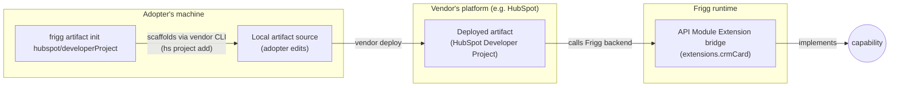

# Architecture Decision Record: Artifacts

**Status**: Proposed
**Date**: 2026-06-09
**Author**: Sean Matthews

## Context

Some Frigg integrations only work when a piece of code or configuration is deployed outside the Frigg runtime, on the provider's platform. A HubSpot UI Extension requires a deployed HubSpot Developer Project. A Slack app requires a published Slack App Manifest. A Salesforce-installed package requires a managed-package upload. None of this code runs in Frigg. Frigg often acts as the backend the deployed code talks to.

These outside-Frigg deliverables do not fit any of the [Extensions](./ADR-EXTENSIONS-TAXONOMY.md) types (extensions run inside the Frigg runtime) and are not [Plugins](./ADR-PLUGINS.md). They are a distinct category.

## Decision

An **Artifact** is code or configuration that an API module helps a developer generate, but that runs outside Frigg on the target platform. Frigg's job is to:

1. Point at the provider's scaffolding mechanism (typically a vendor CLI like `hs project add` or `slack scaffold`)
2. Optionally ship a starter template the developer copies into their artifact
3. Provide the Frigg-side bridge (typically an [API Module Extension](./ADR-API-MODULE-EXTENSIONS.md)) that serves the artifact at runtime

Artifacts live on the API module's Definition under `apiModule.Definition.artifacts`.

### Examples in scope

| Artifact | What runs outside Frigg | What Frigg ships |
|---|---|---|
| HubSpot Developer Project | UI Extension (React app) and serverless functions inside HubSpot Projects | `hs project add` pointer, starter template, `extensions.crmCard` (the API Module Extension that the deployed UI Extension calls into) |
| Slack App Manifest | YAML manifest uploaded to api.slack.com | Manifest template parameterized with the Frigg-side webhook URL, `extensions.eventsApi` bridge |
| Salesforce Managed Package | Apex classes, Lightning components, custom objects packaged for AppExchange | Package metadata template, `extensions.platformEvents` bridge |
| Frontify App Manifest | App config registered with Frontify | Manifest template, `extensions.webhooks` bridge |
| Asana App Components | Modal Forms and Widgets registered with the Asana app | Component config, `extensions.modalForm` and `extensions.widget` bridges |

### Why a distinct ADR rather than folding into API Module Extensions

Three reasons:

1. **Different runtime location.** Extensions run inside Frigg's Lambda. Artifacts run on the provider's platform. Different deployment story, different security boundary, different debugging surface.
2. **Different developer workflow.** Extensions are imported and bound. Artifacts are scaffolded via vendor CLI and deployed to the provider. The Frigg CLI points at the vendor CLI rather than running anything itself.
3. **Required-or-optional varies per capability.** Some [Capabilities](./ADR-CAPABILITIES.md) (HubSpot CRM Card UI) require the artifact to be deployed. Others can use a different mechanism. The capability declaration surfaces this requirement so the agent and adopter know ahead of time.

## Shape (worked example)

```javascript
// @friggframework/api-module-hubspot/definition.js
module.exports = {
    name: 'hubspot',
    artifacts: {
        developerProject: {
            kind: 'hubspot-developer-project',
            scaffoldCommand: 'hs project add',
            startersDir: './artifacts/hubspot-developer-project',
            bridgeExtensions: ['crmCard', 'timelineItem'],
            requiredFor: ['crm.ui.card', 'crm.timeline.item'],
        },
    },
    capabilities: {
        'crm.ui.card': {
            surface: 'ui',
            implementedBy: { kind: 'artifact+extension', artifact: 'developerProject', extension: 'crmCard' },
            requires: { artifact: 'developerProject' },
        },
    },
    extensions: {
        crmCard: require('./extensions/crm-card'),
    },
};
```

The capability `crm.ui.card` declares that it requires the `developerProject` artifact to be deployed. If it is not, the capability is not actually available even though the code is present.

## Architecture



The artifact is produced, deployed, and runs outside Frigg. It talks to Frigg via the bridge extension. Frigg is one side of the contract, not the executor.

## What artifacts are not

- Not a fourth extension type. Extensions run inside Frigg; artifacts run outside.
- Not an Integration Template. Templates are adopter-owned code that runs inside Frigg. Artifacts are adopter-owned code that runs outside Frigg.
- Not a Plugin. Plugins swap infrastructure under Frigg core. Artifacts add capabilities that require off-platform deployment.

## Cross-references

- [API-MODULE-EXTENSIONS](./ADR-API-MODULE-EXTENSIONS.md): bridge extensions (the Frigg-side runtime that serves an artifact) are typically API Module Extensions
- [CAPABILITIES](./ADR-CAPABILITIES.md): capabilities can declare `requires: { artifact: ... }` to surface deployment dependencies
- [EXTENSIONS-TAXONOMY](./ADR-EXTENSIONS-TAXONOMY.md): Artifacts are a sibling, not a fourth extension type
- [AGENT-HARNESS](./ADR-AGENT-HARNESS.md): the harness knows which capabilities require artifact deployment and surfaces that as a planning constraint

## Open questions

1. **Detection of artifact deployment.** Frigg can know the artifact exists in the adopter's repo. Can it know the artifact has been deployed to the vendor? Some vendors expose this (HubSpot lists installed Projects); others do not. Lean: declared by the adopter (`appDefinition.artifacts.deployed: ['hubspot/developerProject']`) until vendor APIs make this introspectable.
2. **Artifact versioning vs API module versioning.** A HubSpot Developer Project has its own version. The API module has its own version. Mismatch is possible. Lean: bridge extensions check artifact version at runtime and fail loud.
3. **Multi-vendor artifacts.** Are there cases where one logical artifact spans two vendors? Probably not yet. Worth noting before something forces the question.
4. **Starter-template hosting.** Where do artifact starters live? Lean: `apiModule/artifacts/<artifact-kind>/` inside the API module package, copied via `frigg artifact init`.

## References

- HubSpot Developer Projects and UI Extensions documentation
- Slack App Manifest format documentation
- Salesforce managed-package documentation
- Asana and Frontify app structures in adopter Frigg repos already implement this pattern informally. This ADR names it.
