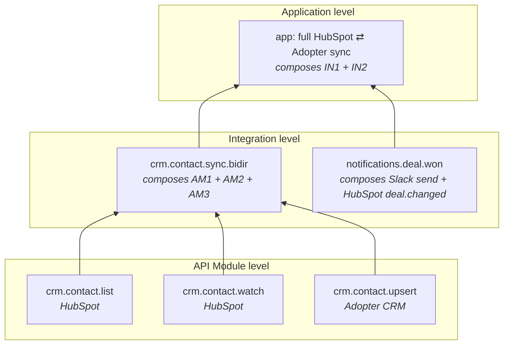

# Architecture Decision Record: Capabilities

**Status**: Proposed (replaces [ADR-INTEGRATION-CAPABILITIES](./ADR-INTEGRATION-CAPABILITIES.md) with a broader scope)
**Date**: 2026-06-09
**Author**: Sean Matthews

## Context

Frigg's `static Definition` blocks today carry mechanical metadata — `name`, `version`, `modules`, `routes`, `webhooks` — but no structured statement of what a piece of Frigg *can do*. Reading any Frigg codebase to answer "what does this app, integration, or API module actually do?" requires traversing class methods, event registrations, route handlers, and constructor wiring.

That blocks two consumers:

1. **Agents reasoning about a Frigg codebase.** A Claude Code agent (or any LLM tool) asked to add a new workflow needs to know what already exists before it can extend it. Today, the only answer is "read all the source." That's expensive and error-prone — and it produces the kind of "I declared four routes for what should have been one route + two config-options + one user action" mistakes that show up in PR review.
2. **Humans needing a view of an app's surface without reading code.** Dashboards, docs, change-impact analysis, and UI auto-rendering all want a structured answer to "what does this thing expose?" Today they don't have one; everything is reverse-engineered from code.

This ADR introduces **Capabilities** as Frigg's first-class answer to both consumers.

## Decision

A **Capability** is a typed, structured declaration on a Frigg `Definition` that names a piece of behavior, points at its spec, and points at its implementation — without being the implementation. Capabilities tie tightly to the code they describe; they are not the code.

Capabilities exist at **three levels of Frigg**, each composing from the level below:

| Level | Lives on | Answers |
|---|---|---|
| **API Module Capabilities** | `apiModule.Definition.capabilities` | "What can this provider's API do that we've wired up?" (list contacts, watch deal changes, send a message) |
| **Integration Capabilities** | `IntegrationBase.Definition.capabilities` | "What workflow does this integration expose?" (sync contacts bidirectionally, route inbound webhooks to a destination, surface this dashboard) |
| **Application Capabilities** | `appDefinition.capabilities` | "What does the whole app expose to its users?" (a top-level view computed from the integrations it loads + any app-level extensions) |

Each capability declares:

- A **name** — stable identifier (`crm.contact.sync`, `notifications.slack.send`)
- A **surface** — what kind of capability it is (sync, action, webhook, ui, lifecycle, ai-inference, mcp-tool, config, cron)
- A pointer to its **spec** — OpenAPI, AsyncAPI, Arazzo, Fenestra, or a free-form schema reference
- A pointer to its **implementation** — where in code (or in a Tier 3 extension, template, or artifact) the capability is wired
- Optional **dependencies** — other capabilities (typically lower-level) it composes from

## The two consumers

Capabilities serve two consumers, and the shape is designed to satisfy both without forking.

### Agentic consumption

An agent traversing a Frigg codebase queries the capability graph instead of reading source. Concretely:

```
agent: "I need to add bidirectional contact sync between HubSpot and the adopter's CRM."

→ resolver returns:
  - HubSpot module has capability `crm.contact.list` (spec: hubspot-openapi#/contacts.list)
  - HubSpot module has capability `crm.contact.watch` (spec: hubspot-asyncapi#/contact.changed)
  - No adopter-side module exists yet → agent scaffolds one via INTEGRATION-TEMPLATES
  - Integration capability `crm.contact.sync.bidir` composes from both modules' caps
```

The agent doesn't read code to plan; it reads capabilities, then writes code to bind capabilities. The [Agent Harness](./ADR-AGENT-HARNESS.md) is the wiring that makes this query happen at session start; the [Ontology](./ADR-ONTOLOGY.md) is the convention layer that tells the agent how to interpret the graph.

### Visibility-without-traversal consumption

The capability graph renders to humans without anyone reading source. Concretely:

- `GET /api/capabilities` on a deployed Frigg app returns the composed graph (api modules → integrations → app)
- The management UI renders the graph as "this app can do: …" with drill-down to spec + implementation pointers
- Docs generators produce API/integration/app reference pages from capabilities
- Change-impact analysis flags downstream consumers when a low-level capability changes shape

This is the answer to "what does this thing expose?" that today requires reading code.

## Composition across levels



A capability at one level always points down to the lower-level capabilities it composes from. The graph is acyclic (composition is one-directional) and queryable from either end — bottom-up ("what uses this API module capability?") and top-down ("what does this app actually do?").

## Shape (worked example)

API module level:

```javascript
// @friggframework/api-module-hubspot/definition.js
module.exports = {
    name: 'hubspot',
    capabilities: {
        'crm.contact.list': {
            surface: 'data-read',
            spec: { kind: 'openapi', ref: './specs/hubspot-openapi.yaml#/paths/~1crm~1v3~1objects~1contacts/get' },
            implementedBy: { kind: 'api-class-method', ref: 'HubSpotApi.listContacts' },
        },
        'crm.contact.watch': {
            surface: 'webhook-source',
            spec: { kind: 'asyncapi', ref: './specs/hubspot-asyncapi.yaml#/channels/contact.changed' },
            implementedBy: { kind: 'extension', ref: 'extensions.webhooks', extensionEvent: 'CONTACT_CHANGED' },
        },
    },
};
```

Integration level:

```javascript
// in MyIntegration's Definition
capabilities: {
    'crm.contact.sync.bidir': {
        surface: 'sync',
        spec: { kind: 'arazzo', ref: './specs/bidir-sync.arazzo.yaml' },
        implementedBy: { kind: 'template', ref: '@friggframework/integration-templates/sync-bidir' },
        dependsOn: [
            { module: 'hubspot', capability: 'crm.contact.list' },
            { module: 'hubspot', capability: 'crm.contact.watch' },
            { module: 'adopter', capability: 'crm.contact.upsert' },
        ],
    },
},
```

App level capabilities are usually *computed* (the union of declared integration capabilities) rather than declared explicitly. An app can override or annotate, but the default is "what the integrations expose."

## Cross-references

- [PLUGINS](./ADR-PLUGINS.md) — plugins are not capabilities (they're infra swaps), but capabilities can declare `requires` against plugin types (e.g. "this capability needs an AWS deployment")
- [EXTENSIONS-TAXONOMY](./ADR-EXTENSIONS-TAXONOMY.md), [CORE-EXTENSIONS](./ADR-CORE-EXTENSIONS.md), [INTEGRATION-EXTENSIONS](./ADR-INTEGRATION-EXTENSIONS.md), [API-MODULE-EXTENSIONS](./ADR-API-MODULE-EXTENSIONS.md) — extensions are pointed at by `implementedBy`
- [INTEGRATION-TEMPLATES](./ADR-INTEGRATION-TEMPLATES.md) — templates are pointed at by `implementedBy` and typically declare a capability set the template promises
- [ARTIFACTS](./ADR-ARTIFACTS.md) — artifacts are pointed at by `implementedBy` when a capability needs outside-Frigg code (HubSpot Project, Slack manifest)
- [ONTOLOGY](./ADR-ONTOLOGY.md) — the ontology contains capability naming and surface-kind conventions
- [AGENT-HARNESS](./ADR-AGENT-HARNESS.md) — the harness compiles + injects the capability graph at session start

## Open questions

1. **Capability namespacing.** `crm.contact.sync.bidir` vs `crm/contact/sync.bidir` vs `crm:contact:sync:bidir`. Lean dot-notation for filesystem-safety and grep-ability.
2. **App-level capability computation.** Always computed from integrations, or sometimes explicitly declared (e.g. for app-level capabilities that don't belong to a single integration — global webhooks, dashboards)?
3. **Surface enum scope.** Initial set: `sync, data-read, data-write, action, webhook-source, webhook-sink, ui, lifecycle, ai-inference, mcp-tool, config, cron`. Open to additions; closed to free-form strings (so the rendering UI can be exhaustive).
4. **Spec-kind enum scope.** Initial set: `openapi, asyncapi, arazzo, fenestra, json-schema, free-form`. Same closed-set treatment.
5. **Versioning.** Do capabilities carry their own version, or inherit from their parent Definition's version?

## References

- Mike Amundsen's writing on the API resource graph as the unit of agent reasoning
- The OpenAPI / AsyncAPI / Arazzo specs that capabilities point at
- ShadCN's "this component owns its surface" philosophy, applied at the capability level
