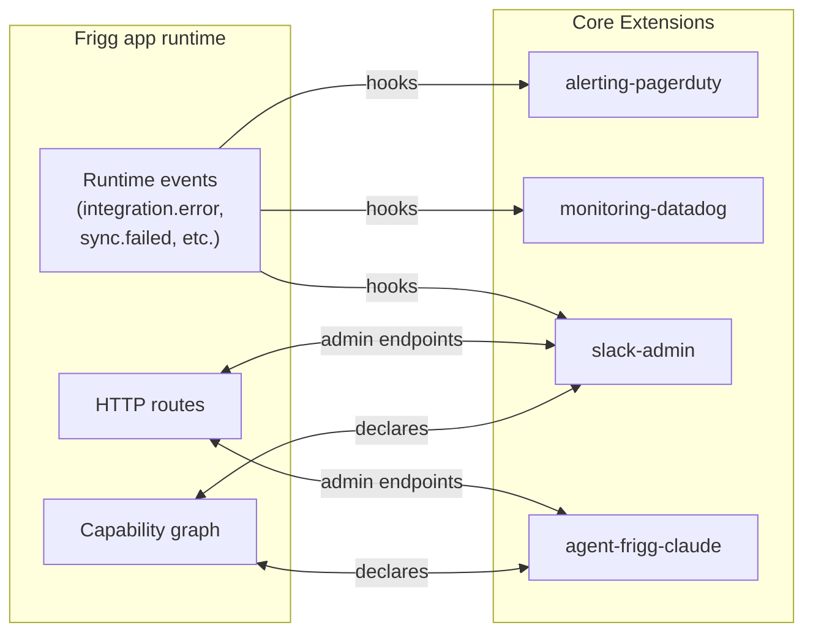

# Architecture Decision Record: Core Extensions

**Status**: Proposed
**Date**: 2026-06-09
**Author**: Sean Matthews

## Context

Frigg apps need cross-cutting functionality that isn't tied to any one integration: alerting when a sync fails, monitoring of queue depth, an admin Slack bot, an agent that can answer "what does this app do" against the [Capability](./ADR-CAPABILITIES.md) graph. None of this belongs inside an integration — it operates at the *application* layer, observing or augmenting Frigg as a whole.

Today there's no first-class place for this code. Adopters either copy-paste boilerplate into `index.js`, fork core, or wire it into an integration where it doesn't belong. This ADR establishes **Core Extensions** as the app-level optional functionality layer.

## Decision

A **Core Extension** is a package that adds optional functionality at the *application* level — observing the Frigg runtime, augmenting its surfaces, or exposing app-wide capabilities. Core Extensions live on `appDefinition.extensions`.

Core Extensions differ from the other two extension types:

- **[Integration Extensions](./ADR-INTEGRATION-EXTENSIONS.md)** add functionality to *one integration* (sync engine, webhook receiver). Core Extensions add functionality to *the whole app*.
- **[API Module Extensions](./ADR-API-MODULE-EXTENSIONS.md)** are provider-specific bundles consumed by Integration Extensions. Core Extensions are app-level and provider-agnostic.

### Examples in scope

| Extension | What it does |
|---|---|
| `@friggframework/extension-alerting-pagerduty` | Routes integration errors / sync failures to PagerDuty |
| `@friggframework/extension-monitoring-datadog` | Emits Frigg runtime metrics to Datadog |
| `@friggframework/extension-slack-admin` | Slack bot that responds to `/frigg status`, `/frigg replay`, `/frigg integrations` against the running app |
| `@friggframework/extension-agent-frigg-claude` | Embedded agent surface — query the [Capability](./ADR-CAPABILITIES.md) graph, propose sync flows, scaffold integrations |
| `@friggframework/extension-audit-log` | Append-only audit log of every credential change, integration toggle, admin action |
| `@friggframework/extension-mcp-server` | Exposes the app's capabilities as MCP tools for external agent consumption |

## Shape (worked example)

```javascript
// backend/index.js
const appDefinition = {
    name: 'my-frigg-app',
    plugins: { /* ... */ },

    extensions: {
        alerting: {
            extension: require('@friggframework/extension-alerting-pagerduty'),
            config: { serviceKey: process.env.PAGERDUTY_KEY, severityMap: { sync_failed: 'error' } },
        },
        agent: {
            extension: require('@friggframework/extension-agent-frigg-claude'),
            config: { modelId: 'claude-opus-4-7', exposureScope: 'admin-only' },
        },
    },

    integrations: [ /* ... */ ],
};
```

The binding key (`alerting`, `agent`) is the local name; the extension reference is whatever the package exports.

### Extension contract (what the package exports)

```javascript
// @friggframework/extension-alerting-pagerduty
module.exports = {
    name: 'alerting-pagerduty',
    type: 'core-extension',

    hooks: {
        'integration.error': async ({ integration, error, config }) => { /* page */ },
        'sync.failed': async ({ integration, syncId, error, config }) => { /* page */ },
    },
    routes: [ /* optional admin endpoints */ ],
    capabilities: { /* declared per ADR-CAPABILITIES */ },
};
```

The contract is intentionally thin — `hooks` (subscribed to runtime events), optional `routes` (admin surfaces), optional `capabilities` (so the extension's offerings appear in the app-level capability graph).

## Architecture



Each Core Extension is its own concern; they don't talk to each other directly. Coordination happens through the runtime event bus and the capability graph.

## Why this matters for the harness

The [Agent Harness](./ADR-AGENT-HARNESS.md) reads `appDefinition.extensions` at session start to know what app-level capabilities exist. If `extension-agent-frigg-claude` is loaded, the harness knows the app already has a Claude surface; if `extension-mcp-server` is loaded, the harness can suggest MCP-tool patterns. Without this declaration, the agent would have to read source to find out.

## Cross-references

- [EXTENSIONS-TAXONOMY](./ADR-EXTENSIONS-TAXONOMY.md) — Core Extensions in context
- [INTEGRATION-EXTENSIONS](./ADR-INTEGRATION-EXTENSIONS.md) — the other half of the optional-functionality story; these add to *one integration*, not the whole app
- [CAPABILITIES](./ADR-CAPABILITIES.md) — Core Extensions can declare capabilities at the app level
- [AGENT-HARNESS](./ADR-AGENT-HARNESS.md) — the harness reads installed Core Extensions to constrain planning

## Open questions

1. **Hook event names.** Initial set: `integration.error`, `integration.installed`, `integration.removed`, `sync.started`, `sync.completed`, `sync.failed`, `webhook.received`, `webhook.failed`. Closed enum or open?
2. **Cross-extension dependencies.** Can an alerting extension depend on a monitoring extension (e.g. "use Datadog APM trace IDs in PagerDuty payloads")? Lean: yes, declared via `dependsOn` in the binding.
3. **Lifecycle for app-level extensions.** Do they need teardown semantics? Today the framework doesn't have a clean "app shutdown" point — Lambda just goes cold. Worth deciding before this lands.
4. **Configuration UI for Core Extensions.** The management UI today knows how to render integration config; should it learn to render Core Extension config too?

## References

- The Slack admin bot pattern is well-established in adopter Frigg apps (Quo, AES); this ADR formalizes it as a first-class extension type rather than a per-app bespoke
