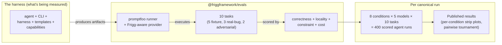

# Architecture Decision Record: Evals

**Status**: Proposed (rewrite of [ADR-EVALS](./ADR-EVALS.md), now deleted)
**Date**: 2026-06-09
**Author**: Sean Matthews

## Context

The other ADRs in this set make value claims — capabilities, ontology, harness, templates — that an agent working on Frigg produces better output with all of them than without. We can't ship rolling adoption on intuition; the design needs measurement. This ADR specifies what to measure, how, and the falsification criteria that gate broader rollout.

A cheap precursor — single-task, three-arm, manual — lives at [`lefthookhq/lefthook--dev-toolkit:evals/PLAN.md`](https://github.com/lefthookhq/lefthook--dev-toolkit/blob/claude/frigg-integration-overhaul-57VHW/evals/PLAN.md). The precursor's job is to decide whether the canonical eval described here is worth the build cost.

## Decision

Build an 8-condition factorial eval under `@friggframework/evals` that measures the three Frigg-side independent variables — capability declaration, ontology layers, agent harness — across a model ladder and a fixed task pack. Use [promptfoo](https://www.promptfoo.dev/) as the runner (Node-native, MIT, mature) with a custom Frigg-aware provider for the agent-in-sandbox loop.

### Hypothesis (falsifiable)

Each of `{capability declaration, ontology layers, agent harness}` independently improves agent task-completion accuracy on Frigg integration tasks at p < 0.05 over five canonical runs. All three combined achieve ≥90% composite score on the framework eval task set, **and the lift is preserved at Haiku-class models** — Haiku in the all-three-enabled condition reaches ≥80% (90% aspirational).

### Eight-condition factorial matrix

|  | Capability | Ontology | Harness |
|---|---|---|---|
| **Baseline** | ✗ | ✗ | ✗ |
| **Cap only** | ✓ | ✗ | ✗ |
| **Ont only** | ✗ | ✓ | ✗ |
| **Harn only** | ✗ | ✗ | ✓ |
| **Cap + Ont** | ✓ | ✓ | ✗ |
| **Cap + Harn** | ✓ | ✗ | ✓ |
| **Ont + Harn** | ✗ | ✓ | ✓ |
| **All three** | ✓ | ✓ | ✓ |

With harness off but capability or ontology on, the content is provided via direct system-prompt prefix (no pinning, no subagent propagation) so the variable is genuinely isolated.

### Model ladder

| Model | Tier | Why |
|---|---|---|
| Claude Haiku 4.5 | Low (cost-sensitive) | Weak-model test — the design must work *here*, not just at Opus |
| Claude Sonnet 4.6 | Mid | Typical adopter agent tier |
| Claude Opus 4.7 | High | Upper bound on Claude capability today |
| GPT-5 | Cross-vendor frontier | Verifies the design isn't accidentally Claude-specific |
| gpt-oss-120b | Open-weights | Generalizes to local / self-hosted runs (data-residency adopters) |

Canonical run cost: ~$50–150 (8 conditions × 5 models × 10 tasks = 400 runs, Opus + GPT-5 dominate). Iterative subset runs: <$5.

### Task pack (10 tasks at v1)

Three categories, with locked counts:

| Category | Count | Operates on | Purpose |
|---|---|---|---|
| Generic / fixture | 5 | Synthetic `FixtureCRMIntegration` etc. shipped with `@friggframework/evals` | General lift independent of adopter codebase bias |
| Real-bug-derived | 3 | Mocked replays of bugs that actually surfaced (e.g. the Pipedrive `/settings` smell) | Verify the design catches *real* failure modes |
| Adversarial / constraint | 2 | Prompts asking the agent to violate a locked constraint | Verify locked ontology rules survive prompt pressure |

Each task ships: prompt, sandboxed fixture, golden diff, golden test suite. Specific task list lives in `packages/evals/tasks/` once implemented; the [ADR-EVALS prior version](./ADR-EVALS.md) enumerates the proposed v1 set.

### Scoring rubric

Four dimensions, reported separately and combined:

| Dimension | Type | How |
|---|---|---|
| **Correctness** | Binary | Run golden test suite against agent diff |
| **Locality** | [0, 1] | `min(1, goldenDiffLines / agentDiffLines)` |
| **Constraint adherence** | Binary | Did the agent respect any locked constraints in scope? |
| **Cost** | Continuous | Total tokens + wall-time (reported, not pass/fail) |

Composite: `0.6 × correctness + 0.3 × locality + 0.1 × constraint`.

### Falsification criteria (pre-registered)

The eval gates broader rollout. The first canonical run after the implementation packages land must clear:

1. **All-three at Haiku ≥80% composite.** The weak-model promise.
2. **Capability-only at Sonnet ≥15pp lift over baseline.** Capability's standalone value.
3. **Ontology-only at Sonnet ≥10pp lift over baseline.** Ontology's standalone value.
4. **Harness-only at Sonnet ≥10pp lift over baseline.** Harness's standalone value (delivery mechanism net of content).
5. **Monotonicity.** Adding any variable never *decreases* composite by >5pp.
6. **Locked-constraint adherence ≥95%** across 2 adversarial × 5 models × 4 conditions-with-ontology = 40 trials.

**If 1–4 are missed by >5pp**, rollout pauses; design / implementation / prompt tuning revisited. The shape of the design isn't invalidated by one missed threshold — but the value claim doesn't survive the data refusing to support it.

**If 5 or 6 are missed at all**, rollout stops. A design that degrades when a variable is added, or that fails locked invariants under prompt pressure, has a deeper problem than tuning can fix.

## Architecture

The harness is the loop being measured; the eval is the loop measuring it.

## Relationship to the precursor

The [`lefthookhq/lefthook--dev-toolkit:evals/PLAN.md`](https://github.com/lefthookhq/lefthook--dev-toolkit/blob/claude/frigg-integration-overhaul-57VHW/evals/PLAN.md) precursor is a *cheap upstream check*: three arms (Raw / Skill / Skill+Ontology+Validation+Friction), two tasks, three replications = 18 runs. It deconfounds nothing — Arm C is a bundle — but it produces signal cheaply about whether the canonical 8-condition matrix here is worth building at all. The kill criteria in the precursor map onto criteria 1, 2, 3 above; if the precursor fails them, this ADR's implementation pauses pending design revision.

## Cross-references

- [CAPABILITIES](./ADR-CAPABILITIES.md), [ONTOLOGY](./ADR-ONTOLOGY.md), [AGENT-HARNESS](./ADR-AGENT-HARNESS.md) — the three variables under test
- [INTEGRATION-TEMPLATES](./ADR-INTEGRATION-TEMPLATES.md), [PLUGINS](./ADR-PLUGINS.md), [EXTENSIONS-TAXONOMY](./ADR-EXTENSIONS-TAXONOMY.md) — additional pieces the harness composes; tested as part of the harness condition rather than as independent variables (their lift is mechanistically tied to the harness wiring them in)
- Precursor plan: [`lefthookhq/lefthook--dev-toolkit:evals/PLAN.md`](https://github.com/lefthookhq/lefthook--dev-toolkit/blob/claude/frigg-integration-overhaul-57VHW/evals/PLAN.md)

## Open questions

1. **Task selection finalization.** The v1 task list (in the prior ADR-EVALS) needs Daniel's review for representativeness before the canonical run. Templates / artifacts coverage may need an 11th task.
2. **Judge model.** Non-Claude judge (GPT-5.1 primary) — per Panickssery et al. on judge self-preference, and confirmed in the precursor plan. Same approach applies here.
3. **Result publication cadence.** Run per major framework release? Per ADR-impacting PR? On a schedule? Lean: major release + on-demand.
4. **Adopter SDK pattern.** Should `@friggframework/evals` expose a runner adopters can use against *their* Frigg apps to confirm the design lifts in their context? Lean: yes, Phase 2 after the canonical run validates.
5. **Cross-model judge variance.** Sample of runs scored by Gemini 2.5 Pro for variance characterization, per the precursor plan.

## References

- [ADR-EVALS](./ADR-EVALS.md) — the prior, longer version of this ADR (deleted in this rework); detailed task list and implementation phases live there until they migrate into `packages/evals/`
- [Precursor plan](https://github.com/lefthookhq/lefthook--dev-toolkit/blob/claude/frigg-integration-overhaul-57VHW/evals/PLAN.md) — cheap upstream check before this canonical eval is built
- METR's long-task variance work, SWE-bench Verified, Chatbot Arena pairwise framework — methodology grounding (full citations in the precursor's RESEARCH-NOTES.md)
