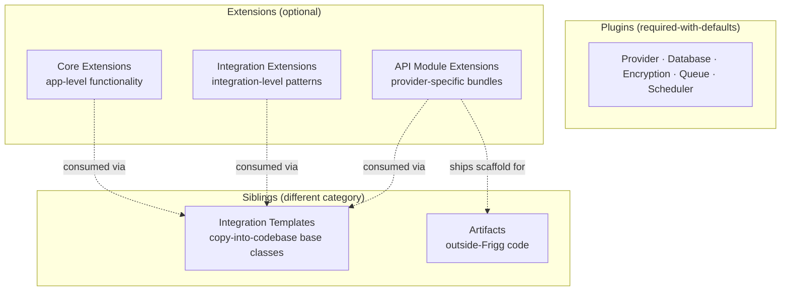

# Architecture Decision Record: Extensions Taxonomy

**Status**: Proposed
**Date**: 2026-06-09
**Author**: Sean Matthews

## Context

Frigg has used the word "extension" for several different things: app-level functionality additions, integration-class plugged-in bundles, provider-specific webhook handlers, and (in conversation) sometimes for templates and artifacts. Adopters and contributors cannot tell which is meant from context, and the prior ADR set bundled three distinct shapes into one document.

This ADR defines **Extensions** as one of Frigg's two top-level categories of swap-in code, alongside [Plugins](./ADR-PLUGINS.md), and points to per-type ADRs for each kind.

## Decision

An **Extension** is a package that adds optional functionality to a Frigg app, an integration, or an API module. Extensions differ from [Plugins](./ADR-PLUGINS.md):

| | Plugins | Extensions |
|---|---|---|
| Required? | Yes (with defaults) | No |
| What they swap | Infrastructure under the framework | Functionality on top of the framework |
| Granularity | One per type per app | Any number |
| Examples | Database, deploy target, encryption | Alerting, sync engine, webhook receiver |

Extensions split into three types, each with its own ADR:

| Type | Lives on | Authored by | Concern |
|---|---|---|---|
| **[Core Extensions](./ADR-CORE-EXTENSIONS.md)** | `appDefinition.extensions` | App developer, framework, community | App-level functionality (alerting, monitoring, agents, Slack interaction) |
| **[Integration Extensions](./ADR-INTEGRATION-EXTENSIONS.md)** | `IntegrationBase.Definition.extensions` | API module, shared library, app developer | Integration-level patterns (sync engine, durable workflows, fan-out and fan-in, state machines, common user actions, multi-page config, field mapping) |
| **[API Module Extensions](./ADR-API-MODULE-EXTENSIONS.md)** | `apiModule.extensions` | API module author | Provider-specific bundles (e.g. `hubspot.extensions.webhooks`) consumed by Integration Extensions |

### Adjacent siblings

Two concepts are often discussed alongside extensions but belong to their own categories:

- **[Integration Templates](./ADR-INTEGRATION-TEMPLATES.md)**: ShadCN-style copy-into-your-codebase base integrations. Templates are owned by the adopter after the copy; extensions are imported and consumed. Different lifecycle, different authoring story.
- **[Artifacts](./ADR-ARTIFACTS.md)**: code or configuration that runs outside Frigg (HubSpot Project, Slack manifest, Salesforce managed package). Extensions run inside Frigg's runtime; artifacts run on the target platform.

## Architecture

Each box has its own ADR; this ADR is the map.

## Why the split

The three extension types have three distinct authoring roles, three distinct lifecycles, and three distinct contracts:

- Core Extensions are authored by people working at the application level (devops, observability, app-wide Slack alerts).
- Integration Extensions are authored by people working on integration patterns that recur across providers (a sync engine is a sync engine whether the provider is HubSpot or Salesforce).
- API Module Extensions are authored by people working on one specific provider (HubSpot's signed-URL webhook scheme, Slack's Events API rate limits).

Combining them into one ADR or one runtime mechanism mixes those concerns. Splitting them lets each evolve at its own pace and surfaces the design constraints relevant to each type.

## Cross-references

- [PLUGINS](./ADR-PLUGINS.md): the other top-level category (required-with-defaults infrastructure swaps)
- [CORE-EXTENSIONS](./ADR-CORE-EXTENSIONS.md), [INTEGRATION-EXTENSIONS](./ADR-INTEGRATION-EXTENSIONS.md), [API-MODULE-EXTENSIONS](./ADR-API-MODULE-EXTENSIONS.md): the three extension types
- [INTEGRATION-TEMPLATES](./ADR-INTEGRATION-TEMPLATES.md), [ARTIFACTS](./ADR-ARTIFACTS.md): adjacent siblings
- [CAPABILITIES](./ADR-CAPABILITIES.md): capabilities can be `implementedBy` an extension of any of the three types

## Open questions

1. **Naming clarity for adopters.** "Core Extensions" vs "App Extensions" vs "Application Extensions". Which is least confusable with the `@friggframework/core` package name? Lean "Core Extensions" but flag.
2. **Cross-type composition.** Can a Core Extension declare a dependency on an Integration Extension, or vice versa? Lean: yes, declared explicitly; default to no implicit cross-talk.
3. **Should `Definition.webhooks: true` (the legacy per-account webhook shortcut) become an extension, or stay as a shortcut?**

## References

- The original monolithic `ADR-EXTENSIONS.md` (deleted in this rework) contained the prior taxonomy under "three tiers". This ADR renames "tiers" to "types" because the prior name implied an ordering that did not exist.
