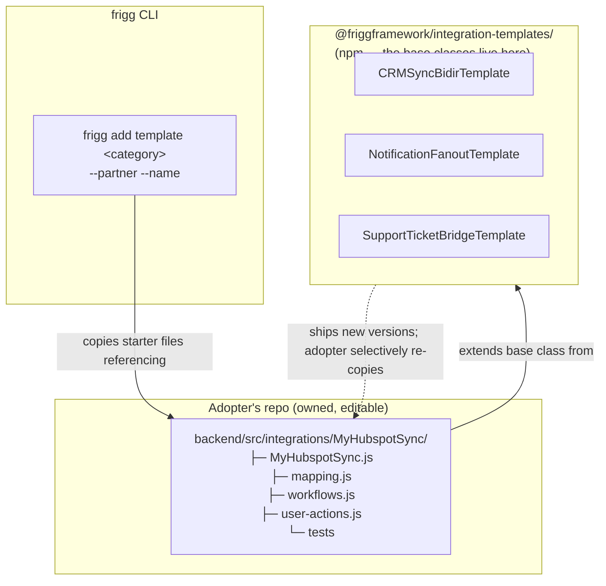

# Architecture Decision Record: Integration Templates

**Status**: Proposed (net-new concept)
**Date**: 2026-06-09
**Author**: Sean Matthews

## Context

`frigg install hubspot` today gets an adopter as far as "a HubSpot API module is registered and the integration class is scaffolded." From there the developer writes everything else: which events to listen for, how to map fields, how to sync records, what user actions to expose. The framework provides the *primitives* but not the *patterns* — every adopter rebuilds bidirectional contact sync, every adopter rebuilds field-mapping UI, every adopter rebuilds initial-sync + reconciliation flow.

Two existing concepts are adjacent but don't solve this:

- **[API Module Extensions](./ADR-API-MODULE-EXTENSIONS.md)** are provider-specific bundles. Useful, but coupled to one provider.
- **[Integration Extensions](./ADR-INTEGRATION-EXTENSIONS.md)** are reusable handler bundles. Also useful, but they're plug-in libraries the adopter imports — not a starting point the adopter owns.

What's missing is a starting point: a working integration *base class* for a category (CRM sync, notification fanout, billing reconciliation, support-ticket bridge) that the adopter copies into their codebase, owns, and customizes for the specific provider pair.

## Decision

An **Integration Template** is a category-typed base integration class that an adopter copies into their codebase via the Frigg CLI. The template ships with field mapping pre-built on the *partner side* (e.g. HubSpot, Salesforce), common workflows wired, tests scaffolded — the adopter only maps their own API to the template's expected shape. **Templates mirror the ShadCN philosophy**: copy the proven implementation into your codebase, own it, customize freely, no upstream dependency to bump.

### What makes this ShadCN-shaped, not npm-shaped

| Shape | Adopter owns the code? | Updates? | Customization |
|---|---|---|---|
| **npm-shaped** (today: API modules, extensions) | No | `npm update`, breaking changes possible | Limited to declared config surface |
| **ShadCN-shaped** (Integration Templates) | Yes (copied into their repo) | Manual re-copy if upstream improves | Edit the file directly |

The implication: templates can be opinionated and complete (full integration class, full event handler set, full mapping schema) without locking the adopter in. If the template's bidirectional-sync logic doesn't match the adopter's quirks, they edit the file. If a new template version ships, the adopter compares and selectively re-copies.

### Template categories (initial set)

| Category | What the template ships pre-built |
|---|---|
| **`crm-sync-bidir`** | Bidirectional contact / company / deal sync, field mapping schema, initial-sync + delta-sync + reconciliation, conflict resolution policy, common user actions (resync, pause, test) |
| **`crm-sync-oneway`** | One-way source→destination, daily polling, no webhooks, mapping schema |
| **`notification-fanout`** | Event-in → fanout to N destinations (Slack, email, webhook), routing rules, dedup |
| **`support-ticket-bridge`** | Inbound webhook → ticket creation in destination, comment sync, status mapping |
| **`billing-reconciliation`** | Periodic comparison between two billing sources, diff detection, reconciliation actions |
| **`ui-extension-only`** | No sync; just renders provider-native UI (HubSpot CRM Card, Salesforce Lightning component) backed by Frigg data |

Each category is its own template; we expect this list to grow.

## Shape (worked example)

```bash
$ frigg add template crm-sync-bidir --partner hubspot --name MyHubspotSync
✓ Copied template to backend/src/integrations/MyHubspotSync/
  ├─ MyHubspotSync.js              Integration class (yours to edit)
  ├─ mapping.js                     Field mapping schema (partner side pre-filled)
  ├─ workflows.js                   Initial sync + delta sync + reconciliation
  ├─ user-actions.js                resync, pause, test
  └─ MyHubspotSync.test.js          Scaffolded tests
✓ Updated backend/index.js to register the new integration
ℹ Next: map your adopter API in backend/src/integrations/MyHubspotSync/mapping.js
```

```javascript
// backend/src/integrations/MyHubspotSync/MyHubspotSync.js (copied into the adopter's codebase)
const { CRMSyncBidirTemplate } = require('@friggframework/integration-templates/crm-sync-bidir');
const hubspot = require('@friggframework/api-module-hubspot');
const adopterCrm = require('./AdopterCrmApi');  // adopter writes this
const mapping = require('./mapping');

class MyHubspotSync extends CRMSyncBidirTemplate {
    static Definition = {
        ...CRMSyncBidirTemplate.composeDefinition({
            partner: hubspot,
            adopter: adopterCrm,
            mapping,
        }),
        name: 'my-hubspot-sync',
    };
}

module.exports = MyHubspotSync;
```

The template *base class* lives in `@friggframework/integration-templates/crm-sync-bidir`. The adopter's *integration class* is copied into their repo. The composition is explicit (`composeDefinition({ partner, adopter, mapping })`) so the adopter can see exactly what the template injects and edit it where needed.

## Architecture



The npm package ships base classes (long-lived contract). The CLI copies a *scaffold* (short-lived starting point) that extends the base class. The adopter owns the scaffold.

## Why this is distinct from API Modules + Integration Extensions

A reasonable question: couldn't a sufficiently rich Integration Extension do this? No — for two reasons:

1. **Mapping is adopter-specific code, not extension code.** The adopter has to write *their* field mapping; an extension can't ship that. The template scaffolds the file in the adopter's repo so they can write it once.
2. **Workflow customization is the norm, not the exception.** Adopters routinely need "bidirectional sync, except for this one field which is one-way" or "delta sync, but trigger a reconciliation if the count drift exceeds X." That's edit-the-file territory, not config-via-options territory. Templates put the file in the adopter's hands.

## Cross-references

- [EXTENSIONS-TAXONOMY](./ADR-EXTENSIONS-TAXONOMY.md) — Integration Templates are a sibling to extensions, not a type of extension
- [INTEGRATION-EXTENSIONS](./ADR-INTEGRATION-EXTENSIONS.md) — templates can bind Integration Extensions internally (a CRM sync template binds a sync-engine extension)
- [API-MODULE-EXTENSIONS](./ADR-API-MODULE-EXTENSIONS.md) — templates know their partner module's API Module Extensions and bind them
- [CAPABILITIES](./ADR-CAPABILITIES.md) — each template declares the capability set it promises; this is the contract the adopter inherits and can extend
- [AGENT-HARNESS](./ADR-AGENT-HARNESS.md) — the harness uses templates as the dominant scaffold path for new integration work

## Open questions

1. **Re-copy vs upgrade.** When a template ships a new version, how does the adopter compare against their owned copy? `frigg add template ... --diff`? Lean: yes.
2. **Template authoring story.** Who can publish templates? Lefthook first; community via `@frigg-community/integration-templates-*`? Default: open to community, governance TBD.
3. **Template + extension overlap.** A template necessarily ships *some* logic that could also be packaged as an extension. The rule of thumb in this ADR is "templates ship adopter-owned code; extensions ship adopter-imported code" — clear in principle, fuzzy in edge cases.
4. **Per-template tests.** Should `frigg add template` scaffold tests that work out of the box (against fixtures) or only stubs? Lean: against fixtures, so the adopter has a green build immediately.
5. **Composition of templates.** Can an adopter combine two templates (e.g. CRM sync + notification fanout) into one integration class? Lean: yes via multiple inheritance / mixin pattern; needs design.

## References

- [ShadCN](https://ui.shadcn.com/) — the design philosophy this borrows from: pre-built components copied into the consumer's codebase rather than installed as a dependency
- The "common base class integration of a category type" framing from the call with Daniel (2026-06-09)
