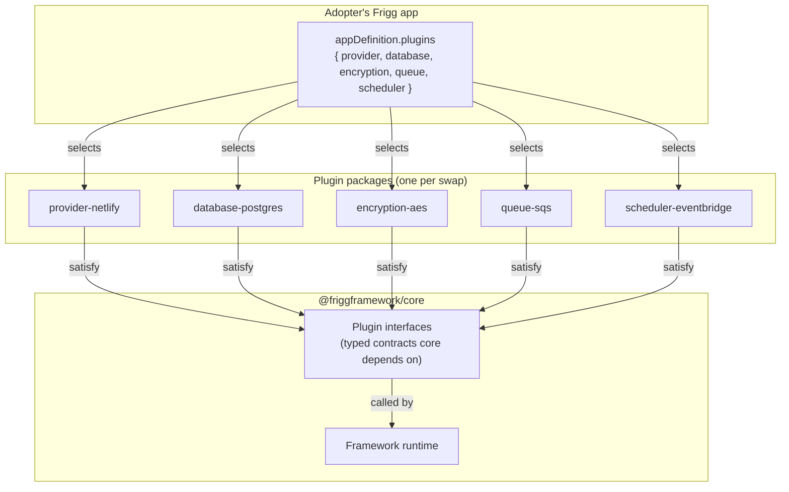

# Architecture Decision Record: Plugins

**Status**: Proposed
**Date**: 2026-06-09
**Author**: Sean Matthews

## Context

`@friggframework/core` today contains direct dependencies on AWS SDK, Mongoose, Postgres clients, AWS KMS, Netlify and Vercel tooling, and every other deployment target and infrastructure choice the framework supports. The dependencies ship to every adopter regardless of which they use.

The current arrangement has two problems:

1. An adopter deploying to GCP carries the AWS SDK in their Lambda bundle. An adopter using Postgres carries Mongoose. An adopter using AES encryption carries AWS KMS dependencies. None of this code runs for them.
2. Adding a new provider (Cloudflare Workers, Fly.io, a new database) requires a change to core rather than a published package.

Plugins let adopters swap required infrastructure pieces without forking core.

## Decision

A **Plugin** is a package that satisfies a core-defined interface so the framework can run on top of it. Plugins are required-with-defaults: core needs some plugin of each type to function, but the adopter picks which.

Plugins differ from [Extensions](./ADR-EXTENSIONS-TAXONOMY.md) in two ways:

- **Required vs optional.** Without a database plugin selected, the framework cannot run. Without an alerting extension, the framework does not alert.
- **Infrastructure vs functionality.** Plugins swap infrastructure under the framework (deploy target, persistence, encryption). Extensions add functionality on top of the framework (alerting, sync engines, provider webhooks).

### Plugin types (initial set)

| Type | What it abstracts | Examples |
|---|---|---|
| **Provider** | Deployment target | `@friggframework/provider-aws`, `@friggframework/provider-netlify`, `@friggframework/provider-vercel`, `@friggframework/provider-gcp` |
| **Database** | Persistence layer | `@friggframework/database-postgres`, `@friggframework/database-mongo`, `@friggframework/database-documentdb`, `@friggframework/database-sqlite` |
| **Encryption** | Field-level encryption mechanism | `@friggframework/encryption-kms`, `@friggframework/encryption-aes` |
| **Queue** | Async job dispatch | `@friggframework/queue-sqs`, `@friggframework/queue-rabbitmq`, `@friggframework/queue-redis` |
| **Scheduler** | Cron and one-time job execution | `@friggframework/scheduler-eventbridge`, `@friggframework/scheduler-mock` |

Each plugin type has a typed interface in core that all plugins of that type satisfy. Core depends on the interface, not on any specific plugin.

## Shape (worked example)

```javascript
// backend/index.js
const appDefinition = {
    name: 'my-frigg-app',

    plugins: {
        provider: { kind: '@friggframework/provider-netlify', region: 'us-east-1' },
        database: { kind: '@friggframework/database-postgres', minCapacity: 0.5, maxCapacity: 1 },
        encryption: { kind: '@friggframework/encryption-aes' },
        queue: { kind: '@friggframework/queue-sqs' },
        scheduler: { kind: '@friggframework/scheduler-eventbridge' },
    },

    integrations: [ /* ... */ ],
};
```

Core resolves each plugin entry at app construction time, validates that it satisfies the interface for its type, and wires it into the framework runtime. Any plugin not listed falls back to a default (typically the AWS-flavored option, for backwards compatibility with v1 deployments).

## Architecture



Adding a new deployment target (Cloudflare Workers, Fly.io) means publishing a package that satisfies the Provider interface. No core change required.

## Relationship to capabilities and the harness

[Capabilities](./ADR-CAPABILITIES.md) can declare `requires` against plugin types. A capability that uses signed S3 URLs declares `requires: { provider: 'aws' }`. The capability resolver warns at boot if the selected provider plugin does not support a required capability, instead of failing at runtime.

The [Agent Harness](./ADR-AGENT-HARNESS.md) reads the selected plugins at session start and uses them to constrain its planning. An agent working in a Netlify-deployed Frigg app does not suggest AWS-specific primitives.

## Cross-references

- [CAPABILITIES](./ADR-CAPABILITIES.md): capabilities may declare plugin-type requirements
- [EXTENSIONS-TAXONOMY](./ADR-EXTENSIONS-TAXONOMY.md): extensions are optional and add functionality; plugins are required and swap infrastructure
- [AGENT-HARNESS](./ADR-AGENT-HARNESS.md): the harness reads selected plugins to constrain agent planning

## Open questions

1. **Plugin discovery.** How does the framework find available plugins of a type? Convention (`@friggframework/provider-*`), explicit registry, or both?
2. **Plugin composition.** Can two plugins of the same type coexist (e.g. write-through caching across two database plugins)? Lean: no, one of each type. Composition would need a separate ADR.
3. **Versioning across plugins.** A v2 core may demand a v2 plugin interface. How are mismatches surfaced: at install time, at boot, or at runtime?
4. **Default plugin selection.** AWS-flavored as the v1 backwards-compat default, or fail-loud and require explicit selection?

## References

- Multi-provider support discussion (link TBD once issue exists)
- The `module-plugin` directory in core is a related but distinct mechanism (it extends the framework, not the infrastructure under it). Renaming proposed as part of this rework.
