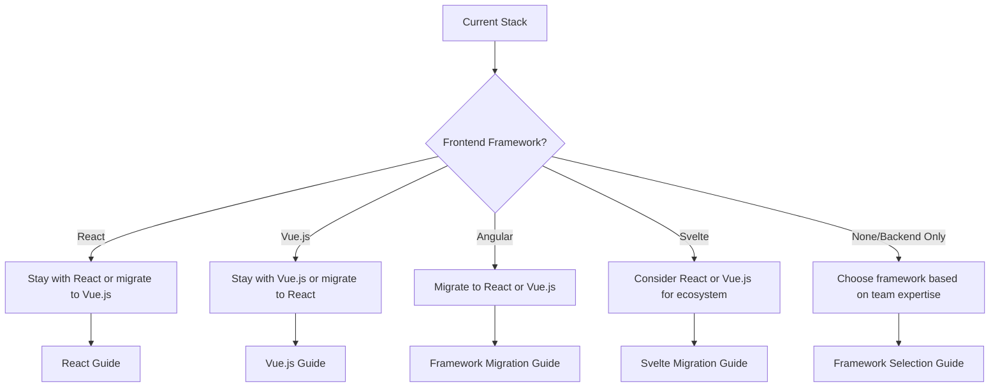

# Migration Guides

This section provides comprehensive migration guides for moving between different Frigg Framework implementations, from legacy systems, and between frontend frameworks.

## Migration Scenarios

### 🔄 Framework-to-Framework Migrations

| From | To | Guide | Difficulty | Time Estimate |
|------|----|---------|-----------|--------------| 
| React | Vue.js | [React → Vue.js](./react-to-vue.md) | Easy | 2-4 hours |
| Vue.js | React | [Vue.js → React](./vue-to-react.md) | Easy | 2-4 hours |
| Angular | React | [Angular → React](./angular-to-react.md) | Moderate | 4-8 hours |
| Angular | Vue.js | [Angular → Vue.js](./angular-to-vue.md) | Moderate | 4-8 hours |
| React | Angular | [React → Angular](./react-to-angular.md) | Moderate | 4-8 hours |
| Vue.js | Angular | [Vue.js → Angular](./vue-to-angular.md) | Moderate | 4-8 hours |
| Svelte | React | [Svelte → React](./svelte-to-react.md) | Easy | 2-4 hours |
| React | Svelte | [React → Svelte](./react-to-svelte.md) | Easy | 2-4 hours |

### 🏗️ Legacy System Migrations

| From | To | Guide | Difficulty | Time Estimate |
|------|----|---------|-----------|--------------| 
| create-frigg-app | Frigg Framework | [Legacy Migration](./from-create-frigg-app.md) | Easy | 1-2 hours |
| Custom Integration | Frigg Framework | [Custom → Frigg](./from-custom.md) | Moderate | 8-16 hours |
| Zapier/iPaaS | Frigg Framework | [iPaaS → Frigg](./from-ipaas.md) | Complex | 1-2 weeks |
| Other Frameworks | Frigg Framework | [Generic Migration](./from-other-frameworks.md) | Variable | Variable |

### 📊 Architecture Migrations

| From | To | Guide | Difficulty | Time Estimate |
|------|----|---------|-----------|--------------| 
| Monolith | Serverless | [Monolith → Serverless](./monolith-to-serverless.md) | Complex | 1-2 weeks |
| REST Only | GraphQL + REST | [Adding GraphQL](./adding-graphql.md) | Moderate | 1-2 days |
| Single Tenant | Multi-tenant | [Multi-tenancy](./single-to-multi-tenant.md) | Complex | 1-2 weeks |

## Quick Migration Decision Matrix

### Choose Your Migration Path

#### Based on Current Technology Stack



#### Based on Team Expertise

| Team Background | Recommended Path | Why |
|----------------|------------------|-----|
| **React Experience** | Stay with React | Minimal learning curve, fastest implementation |
| **Vue.js Experience** | Stay with Vue.js | Leverage existing knowledge, composition API benefits |
| **Angular Experience** | Migrate to React or Vue.js | Better Frigg ecosystem support, simpler patterns |
| **Backend-heavy Team** | Start with React | Large ecosystem, extensive documentation |
| **Mixed Experience** | Choose based on project requirements | Consider long-term maintenance and team growth |

#### Based on Project Requirements

| Requirement | Recommended Framework | Migration Priority |
|-------------|----------------------|-------------------|
| **Fast Development** | React or Vue.js | High |
| **Enterprise Features** | Angular → React/Vue | Medium |
| **Performance Critical** | Svelte → React/Vue | Medium |
| **Large Team** | Standardize on React or Vue.js | High |
| **Rapid Prototyping** | Vue.js | Low |

## Universal Migration Concepts

### Core Components That Transfer

These Frigg concepts remain consistent across all framework migrations:

#### 🔧 Backend Components (No Migration Needed)
- **Integration Definitions** - Remain unchanged
- **Authentication Logic** - Core patterns stay the same
- **Database Models** - No changes required
- **API Endpoints** - Consistent across frameworks
- **Serverless Configuration** - Framework-agnostic

#### 🎨 Frontend Patterns (Require Translation)
- **Component Structure** - Adapt to framework patterns
- **State Management** - Framework-specific implementations
- **Routing** - Different router libraries
- **Styling** - Usually transferable
- **Testing** - Framework-specific test patterns

### Migration Strategy

#### Phase 1: Planning (1-2 days)
1. **Audit Current Implementation**
   - Document current components and functionality
   - Identify framework-specific code vs. business logic
   - List third-party dependencies and their equivalents

2. **Choose Target Framework**
   - Evaluate team expertise and project requirements
   - Review framework-specific Frigg features
   - Plan training and onboarding if needed

3. **Plan Migration Approach**
   - Incremental vs. complete rewrite
   - Parallel development vs. sequential migration
   - Testing and rollback strategies

#### Phase 2: Setup (2-4 hours)
1. **Environment Preparation**
   - Install target framework tools
   - Configure build and development environment
   - Set up Frigg packages for target framework

2. **Project Structure**
   - Create new project structure
   - Configure routing and state management
   - Set up testing framework

#### Phase 3: Migration (Variable)
1. **Core Components First**
   - Migrate authentication components
   - Port integration management interfaces
   - Adapt monitoring and alerting components

2. **Feature Components**
   - Migrate integration-specific components
   - Port custom business logic
   - Adapt styling and theming

3. **Testing and Validation**
   - Unit test migration
   - Integration testing
   - User acceptance testing

#### Phase 4: Deployment (1-2 days)
1. **Production Preparation**
   - Configure build pipeline
   - Set up deployment automation
   - Plan rollback procedures

2. **Go-Live**
   - Deploy to staging environment
   - Validate all functionality
   - Deploy to production with monitoring

## Automated Migration Tools

### Frigg CLI Migration Assistant

```bash
# Analyze current project for migration compatibility
frigg migrate analyze

# Generate migration plan
frigg migrate plan --from react --to vue

# Execute automated migration where possible
frigg migrate execute --plan migration-plan.json

# Validate migration results
frigg migrate validate
```

### Framework-Specific Tools

#### React → Vue.js
```bash
# Install Vue migration tool
npm install -g @friggframework/migrate-react-vue

# Run migration
frigg-migrate react-to-vue ./src --output ./src-vue
```

#### Vue.js → React
```bash
# Install React migration tool
npm install -g @friggframework/migrate-vue-react

# Run migration
frigg-migrate vue-to-react ./src --output ./src-react
```

## Migration Support

### 🛠️ Tools and Resources
- **Migration Scripts** - Automated code transformation
- **Component Mapping** - Cross-framework component equivalents
- **Testing Utilities** - Validate migration success
- **Documentation** - Step-by-step guides for each scenario

### 💬 Community Support
- **Discord Migration Channel** - Real-time help from community
- **Migration Office Hours** - Weekly sessions with Frigg team
- **Case Studies** - Learn from successful migrations

### 🏢 Professional Services
- **Migration Consulting** - Expert guidance for complex migrations
- **Custom Tooling** - Bespoke migration tools for unique scenarios
- **Training Workshops** - Team training on new framework patterns

## Best Practices

### ✅ Do's
- **Plan thoroughly** before starting migration
- **Migrate incrementally** when possible
- **Test extensively** at each phase
- **Document changes** for team knowledge
- **Leverage automated tools** where available
- **Keep backend unchanged** during frontend migrations

### ❌ Don'ts
- **Rush the migration** without proper planning
- **Change multiple things** simultaneously
- **Skip testing** intermediate steps
- **Ignore team training** needs
- **Forget about rollback** plans
- **Mix migration with feature** development

## Getting Started

### 1. Choose Your Migration Path
Review the scenarios above and select the guide that matches your situation.

### 2. Read the Specific Guide
Each migration guide provides detailed steps, code examples, and troubleshooting tips.

### 3. Use Available Tools
Leverage automated migration tools and scripts to reduce manual work.

### 4. Get Support
Join our community channels for help and share your migration experience.

---

**Ready to migrate?** Choose your specific migration guide:

- 🔄 [**Framework-to-Framework Migrations →**](./react-to-vue.md)
- 🏗️ [**Legacy System Migrations →**](./from-create-frigg-app.md)  
- 📊 [**Architecture Migrations →**](./monolith-to-serverless.md)

**Need help?** Join our [Discord migration channel](https://discord.gg/frigg-migration) for real-time support from the community and Frigg team.